# Story Dependency Diagrams - stryker-mutator-bun-runner

**Date:** 2025-01-21
**Author:** Bob (Scrum Master)
**Project Level:** 3 (Comprehensive Product)
**Total Stories:** 52 across 5 epics

---

## Overview

This document provides visual dependency maps for all stories across the 5 epics, helping teams understand implementation sequencing, parallel execution opportunities, and critical path identification.

---

## Epic-Level Dependency Flow

```mermaid
graph TD
    %% Epic Dependencies
    E1[Epic 1: Foundation & Core Plugin Integration]
    E2[Epic 2: Mutation Testing & Result Reporting]
    E3[Epic 3: Coverage Analysis & Performance Optimization]
    E4[Epic 4: Robustness, Security & Production Readiness]
    E5[Epic 5: Documentation, Examples & Release]

    %% Epic Flow
    E1 --> E2
    E2 --> E3
    E3 --> E4
    E4 --> E5

    %% Epic Details
    E1[🏗️ Epic 1<br/>Foundation<br/>10 stories<br/>Week 1]
    E2[🧬 Epic 2<br/>Mutation Testing<br/>10 stories<br/>Weeks 2-3]
    E3[⚡ Epic 3<br/>Performance Optimization<br/>12 stories<br/>Weeks 4-5]
    E4[🔒 Epic 4<br/>Production Readiness<br/>10 stories<br/>Weeks 6-7]
    E5[📚 Epic 5<br/>Documentation & Release<br/>10 stories<br/>Week 8]

    style E1 fill:#e1f5fe
    style E2 fill:#f3e5f5
    style E3 fill:#e8f5e8
    style E4 fill:#fff3e0
    style E5 fill:#fce4ec
```



**Timeline Overview:**
- **Total Duration:** 8 weeks
- **Sequential Execution:** Epics must complete in order
- **Parallel Stories:** Within each epic, stories can have parallel execution

---

## Epic 1: Foundation & Core Plugin Integration

```mermaid
graph TD
    %% Stories
    S1[1.1: Project Setup<br/>🏗️ Infrastructure]
    S2[1.2: Plugin Declaration<br/>📋 Registration]
    S3[1.3: TestRunner Interface<br/>🔌 Skeleton]
    S4[1.4: Configuration Schema<br/>⚙️ Validation]
    S5[1.5: Bun Installation Detection<br/>🔍 Environment]
    S6[1.6: Basic Bun Test Execution<br/>▶️ Subprocess]
    S7[1.7: JSON Output Parsing<br/>📊 Results]
    S8[1.8: DryRun Result Mapping<br/>🗺️ Integration]
    S9[1.9: Basic Error Reporting<br/>🚨 Logging]
    S10[1.10: Async Test Handling<br/>⏱️ Timing]

    %% Dependencies
    S1 --> S2
    S2 --> S3
    S3 --> S4
    S3 --> S5
    S4 --> S6
    S5 --> S6
    S6 --> S7
    S7 --> S8
    S7 --> S9
    S8 --> S10

    %% Parallel Execution Groups
    subgraph "Parallel Start"
        S4
        S5
    end

    subgraph "Parallel Execution"
        S8
        S9
    end

    %% Critical Path
    linkStyle 0 stroke:#ff5252,stroke-width:3px
    linkStyle 1 stroke:#ff5252,stroke-width:3px
    linkStyle 2 stroke:#ff5252,stroke-width:3px
    linkStyle 5 stroke:#ff5252,stroke-width:3px
    linkStyle 6 stroke:#ff5252,stroke-width:3px
    linkStyle 9 stroke:#ff5252,stroke-width:3px

    style S1 fill:#ffcdd2
    style S10 fill:#c8e6c9
```



**Epic 1 Analysis:**
- **Critical Path:** 1.1 → 1.2 → 1.3 → 1.6 → 1.7 → 1.8 → 1.10
- **Parallel Opportunities:**
  - Stories 1.4 (Configuration) and 1.5 (Environment) can run in parallel
  - Stories 1.8 (Result Mapping) and 1.9 (Error Reporting) can run in parallel
- **Estimated Duration:** 1 week
- **Blockers:** Story 1.1 blocks entire project (no infrastructure)

---

## Epic 2: Mutation Testing & Result Reporting

```mermaid
graph TD
    %% Stories
    S2_1["2.1: Mutation Activation<br/>🧬 Environment Variables"]
    S2_2["2.2: File-Based Activation<br/>📁 Alternative Method"]
    S2_3["2.3: MutantRun Implementation<br/>🎯 Core Execution"]
    S2_4["2.4: Mutation Status Detection<br/>📊 Result Analysis"]
    S2_5["2.5: Timeout Management<br/>⏰ Performance"]
    S2_6["2.6: Test Filtering<br/>🔍 Pattern Matching"]
    S2_7["2.7: Source Map Support<br/>🗺️ Debugging"]
    S2_8["2.8: Performance Metrics<br/>📈 Benchmarking"]
    S2_9["2.9: Enhanced Error Classification<br/>🚨 Troubleshooting"]
    S2_10["2.10: Worker Isolation<br/>🔒 Thread Safety"]

    %% Dependencies
    S2_1 --> S2_2
    S2_2 --> S2_3
    S2_3 --> S2_4
    S2_4 --> S2_5
    S2_3 --> S2_6
    S2_4 --> S2_7
    S2_3 --> S2_8
    S2_7 --> S2_9
    S2_9 --> S2_10

    %% Critical Path
    linkStyle 0 stroke:#ff5252,stroke-width:3px
    linkStyle 1 stroke:#ff5252,stroke-width:3px
    linkStyle 2 stroke:#ff5252,stroke-width:3px
    linkStyle 3 stroke:#ff5252,stroke-width:3px
    linkStyle 8 stroke:#ff5252,stroke-width:3px
    linkStyle 9 stroke:#ff5252,stroke-width:3px

    style S2_1 fill:#ffcdd2
    style S2_10 fill:#c8e6c9
```

**Epic 2 Analysis:**
- **Critical Path:** 2.1 → 2.2 → 2.3 → 2.4 → 2.9 → 2.10
- **Major Parallel Opportunity:** Stories 2.5, 2.6, 2.7, 2.8 can run concurrently after 2.3
- **Key Dependencies:**
  - Story 2.3 (MutantRun) enables 4 parallel stories
  - Story 2.7 (Source Maps) required for 2.9 (Error Classification)
- **Estimated Duration:** 2 weeks
- **Prerequisite:** Epic 1 complete

**Parallel Execution Visualization for Epic 2:**


---

## Epic 3: Coverage Analysis & Performance Optimization

```mermaid
graph TD
    %% Stories
    S3_1["3.1: Coverage Mode Configuration<br/>⚙️ Analysis Setup"]
    S3_2["3.2: Native Bun Coverage<br/>📊 Instrumentation"]
    S3_3["3.3: PerTest Coverage Collection<br/>🔍 Individual Tests"]
    S3_4["3.4: Test-to-Mutant Mapping<br/>🗺️ Coverage Analysis"]
    S3_5["3.5: Coverage Confidence Scoring<br/>📈 Quality Metrics"]
    S3_6["3.6: Intelligent Test Filtering<br/>🎯 Smart Selection"]
    S3_7["3.7: Coverage Fallback<br/>🔄 Graceful Degradation"]
    S3_8["3.8: Performance Benchmarking<br/>📊 Validation"]
    S3_9["3.9: Coverage Performance Validation<br/>⚡ Optimization Proof"]
    S3_10["3.10: Bun Version Detection<br/>🔍 Format Adaptation"]
    S3_11["3.11: Coverage Performance Optimization<br/>🚀 Fine-tuning"]
    S3_12["3.12: Large Test Suite Stability<br/>🏗️ Scale Testing"]

    %% Dependencies
    S3_1 --> S3_2
    S3_2 --> S3_3
    S3_3 --> S3_4
    S3_4 --> S3_5
    S3_5 --> S3_6
    S3_6 --> S3_7
    S3_6 --> S3_8
    S3_8 --> S3_9
    S3_7 --> S3_10
    S3_9 --> S3_11
    S3_11 --> S3_12

    %% Critical Path
    linkStyle 0 stroke:#ff5252,stroke-width:3px
    linkStyle 1 stroke:#ff5252,stroke-width:3px
    linkStyle 2 stroke:#ff5252,stroke-width:3px
    linkStyle 3 stroke:#ff5252,stroke-width:3px
    linkStyle 4 stroke:#ff5252,stroke-width:3px
    linkStyle 5 stroke:#ff5252,stroke-width:3px
    linkStyle 10 stroke:#ff5252,stroke-width:3px
    linkStyle 11 stroke:#ff5252,stroke-width:3px

    style S3_1 fill:#ffcdd2
    style S3_12 fill:#c8e6c9
    style S3_3 fill:#fff9c4
    style S3_4 fill:#fff9c4
    style S3_5 fill:#fff9c4
```

**Epic 3 Analysis:**
- **Critical Path:** Linear progression through all 12 stories (most complex epic)
- **High Risk Area:** Stories 3.3-3.5 (PerTest coverage implementation)
- **Key Innovation Point:** Stories 3.4-3.6 deliver the 40-60% performance improvement
- **Fallback Strategy:** Story 3.7 ensures robustness if coverage fails
- **Estimated Duration:** 2-3 weeks (longest epic)
- **Prerequisite:** Epic 2 complete

**Risk Area Visualization for Epic 3:**


---

## Epic 4: Robustness, Security & Production Readiness

```mermaid
graph TD
    %% Stories
    S4_1[4.1: Debug Logging<br/>📝 Observability]
    S4_2[4.2: Sensitive Data Sanitization<br/>🔒 Security]
    S4_3[4.3: Secure Temp Files<br/>📁 File Security]
    S4_4[4.4: Transient Failure Recovery<br/>🔄 Reliability]
    S4_5[4.5: Config Schema Versioning<br/>📋 Migration]
    S4_6[4.6: Stryker Version Validation<br/>🔍 Compatibility]
    S4_7[4.7: Compatibility Matrix<br/>📊 Documentation]
    S4_8[4.8: Comprehensive Test Suite<br/>🧪 Quality Assurance]
    S4_9[4.9: Cross-Platform Testing<br/>🖥️ Platform Support]
    S4_10[4.10: Resource Disposal<br/>🧹 Cleanup]

    %% Dependencies
    S4_1 --> S4_2
    S4_2 --> S4_3
    S4_3 --> S4_4
    S4_1 --> S4_5
    S4_5 --> S4_6
    S4_6 --> S4_7
    S4_4 --> S4_8
    S4_8 --> S4_9
    S4_8 --> S4_10

    %% Parallel Execution Groups
    subgraph "Security Stream"
        S4_1 --> S4_2 --> S4_3 --> S4_4
    end

    subgraph "Compatibility Stream"
        S4_5 --> S4_6 --> S4_7
    end

    subgraph "Quality Stream (after 4.4)"
        S4_8 --> S4_9
        S4_8 --> S4_10
    end

    %% Critical Path
    linkStyle 0 stroke:#ff5252,stroke-width:3px
    linkStyle 1 stroke:#ff5252,stroke-width:3px
    linkStyle 2 stroke:#ff5252,stroke-width:3px
    linkStyle 3 stroke:#ff5252,stroke-width:3px
    linkStyle 6 stroke:#ff5252,stroke-width:3px
    linkStyle 7 stroke:#ff5252,stroke-width:3px
    linkStyle 8 stroke:#ff5252,stroke-width:3px

    style S4_1 fill:#ffcdd2
    style S4_10 fill:#c8e6c9
```



**Epic 4 Analysis:**
- **Three Development Streams:** Security, Compatibility, and Quality can run in parallel
- **Critical Path:** Security stream (4.1 → 4.2 → 4.3 → 4.4 → 4.8 → 4.10)
- **Parallel Opportunities:**
  - Compatibility stream (4.5 → 4.6 → 4.7) can run parallel to security
  - Stories 4.9 and 4.10 can run parallel after 4.8
- **Security Focus:** Stories 4.1-4.4 implement all security requirements
- **Estimated Duration:** 2 weeks
- **Prerequisite:** Epic 3 complete

---

## Epic 5: Documentation, Examples & Release

```mermaid
graph TD
    %% Stories
    S5_1[5.1: Installation Guide<br/>📖 Quick Start]
    S5_2[5.2: Configuration Reference<br/>⚙️ Complete Docs]
    S5_3[5.3: Troubleshooting Guide<br/>🔧 Problem Solving]
    S5_4[5.4: Working Examples<br/>💡 Real Projects]
    S5_5[5.5: API Documentation<br/>📚 Developer Guide]
    S5_6[5.6: Performance Benchmarks<br/>📊 Results Publication]
    S5_7[5.7: Release Process<br/>🚀 Automation]
    S5_8[5.8: Contribution Guidelines<br/>🤝 Community]
    S5_9[5.9: v1.0 Release Prep<br/>🎯 Production Ready]
    S5_10[5.10: Stryker Team Engagement<br/>🌟 Official Adoption]

    %% Dependencies
    S5_1 --> S5_2
    S5_2 --> S5_3
    S5_1 --> S5_4
    S5_2 --> S5_5
    S5_4 --> S5_6
    S5_5 --> S5_7
    S5_7 --> S5_8
    S5_8 --> S5_9
    S5_9 --> S5_10

    %% Parallel Execution Groups
    subgraph "Documentation Stream"
        S5_1 --> S5_2 --> S5_3
    end

    subgraph "Examples Stream"
        S5_4 --> S5_6
    end

    subgraph "Release Stream"
        S5_5 --> S5_7 --> S5_8 --> S5_9 --> S5_10
    end

    %% Critical Path
    linkStyle 0 stroke:#ff5252,stroke-width:3px
    linkStyle 1 stroke:#ff5252,stroke-width:3px
    linkStyle 5 stroke:#ff5252,stroke-width:3px
    linkStyle 6 stroke:#ff5252,stroke-width:3px
    linkStyle 7 stroke:#ff5252,stroke-width:3px
    linkStyle 8 stroke:#ff5252,stroke-width:3px
    linkStyle 9 stroke:#ff5252,stroke-width:3px

    style S5_1 fill:#ffcdd2
    style S5_10 fill:#c8e6c9
```



**Epic 5 Analysis:**
- **Three Parallel Streams:** Documentation, Examples, and Release preparation
- **Critical Path:** Release stream (5.5 → 5.7 → 5.8 → 5.9 → 5.10)
- **Parallel Opportunities:**
  - Documentation stream (5.1 → 5.2 → 5.3) can run independently
  - Examples stream (5.4 → 5.6) can run parallel to documentation
- **Key Milestone:** Story 5.9 (v1.0 Release) is the major project milestone
- **Estimated Duration:** 1 week
- **Prerequisite:** Epic 4 complete

---

## Critical Path Analysis


**Critical Path Summary:**
- **Total Duration:** 8 weeks (40 working days)
- **Key Milestones:**
  - Week 1: Basic plugin functionality
  - Week 3: Full mutation testing
  - Week 5: Performance optimization complete
  - Week 7: Production readiness
  - Week 8: v1.0 release

---

## Parallel Execution Opportunities


**Parallel Development Strategy:**
- **Week 1:** 2 parallel stories (20% parallelization)
- **Week 2-3:** 4 parallel stories (44% parallelization)
- **Week 4-5:** 2 parallel stories (25% parallelization)
- **Week 6-7:** 2 parallel stories (29% parallelization)
- **Week 8:** 2 parallel stories (29% parallelization)

**Resource Allocation:**
- **Solo Developer:** Focus on critical path, use parallel stories for context switching
- **2-Person Team:** Divide critical path and parallel streams
- **3+ Person Team:** Full parallel execution possible

---

## Risk Dependencies

```mermaid
graph TD
    subgraph "High Risk Dependencies"
        R1[3.3 PerTest Coverage<br/>⚠️ Complex Implementation]
        R2[3.4 Test-to-Mutant Mapping<br/>⚠️ Performance Critical]
        R3[3.5 Coverage Confidence<br/>⚠️ Algorithm Complexity]
    end

    subgraph "Medium Risk Dependencies"
        R4[2.1 Mutation Activation<br/>⚠️ Environment Specific]
        R5[4.2 Data Sanitization<br/>⚠️ Security Critical]
        R6[4.8 Comprehensive Testing<br/>⚠️ Quality Gate]
    end

    subgraph "Low Risk Dependencies"
        R7[1.1 Project Setup<br/>✅ Standard Infrastructure]
        R8[5.1 Documentation<br/>✅ Creative Work]
        R9[5.10 Community Engagement<br/>✅ Outreach Activity]
    end

    R1 --> R2 --> R3
    R4 --> R5

    style R1 fill:#fff9c4
    style R2 fill:#fff9c4
    style R3 fill:#fff9c4
    style R4 fill:#fff3e0
    style R5 fill:#fff3e0
    style R6 fill:#fff3e0
    style R7 fill:#e8f5e8
    style R8 fill:#e8f5e8
    style R9 fill:#e8f5e8
```



**Risk Mitigation Strategies:**

1. **High Risk Stories (3.3-3.5):**
   - Allocate extra time (50% buffer)
   - Consider spike/solution validation
   - Have fallback strategy (Story 3.7)

2. **Medium Risk Stories:**
   - Early validation and testing
   - Regular code reviews
   - Incremental delivery approach

3. **Low Risk Stories:**
   - Standard development process
   - Can be used for context switching
   - Good for junior developers

---

## Implementation Recommendations

### For Solo Developer
1. **Focus on Critical Path:** Complete stories sequentially
2. **Use Parallel Stories:** For context switching when blocked
3. **Buffer Time:** Add 20% extra time for high-risk stories

### For 2-Person Team
1. **Divide and Conquer:**
   - Developer 1: Critical path stories
   - Developer 2: Parallel stream stories
2. **Regular Sync:** Daily standups to manage dependencies
3. **Cross-Training:** Rotate between streams for knowledge sharing

### For 3+ Person Team
1. **Full Parallel Execution:** Assign dedicated streams
2. **Specialization:**
   - Security specialist: Stories 4.1-4.4
   - Performance specialist: Stories 3.3-3.6
   - Documentation specialist: Epic 5 stories
3. **Integration Focus:** Regular integration testing for parallel work

---

## Dependency Management Best Practices

1. **Start with Infrastructure:** Story 1.1 is universal blocker
2. **Validate Each Epic:** Don't start next epic until previous epic completion criteria met
3. **Monitor Critical Path:** Track progress on critical path stories
4. **Buffer for Risk:** Add time buffers around high-risk dependencies
5. **Regular Integration:** Test integration points between dependent stories
6. **Document Decisions:** Keep ADRs updated as dependencies are resolved

---

*Document generated by Bob (Scrum Master)*
*Last updated: 2025-01-21*
*Next review: After each epic completion*