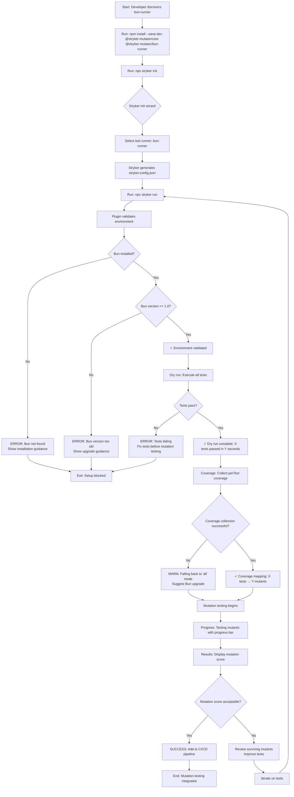
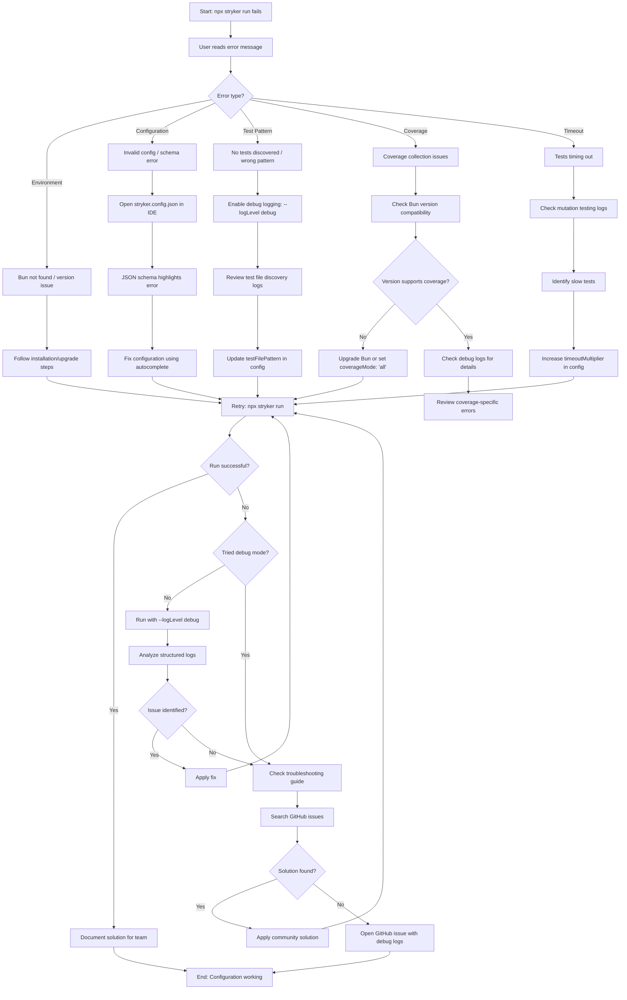
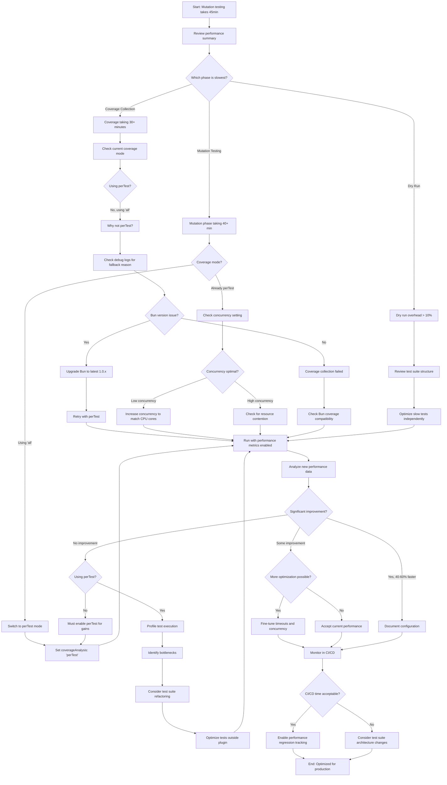
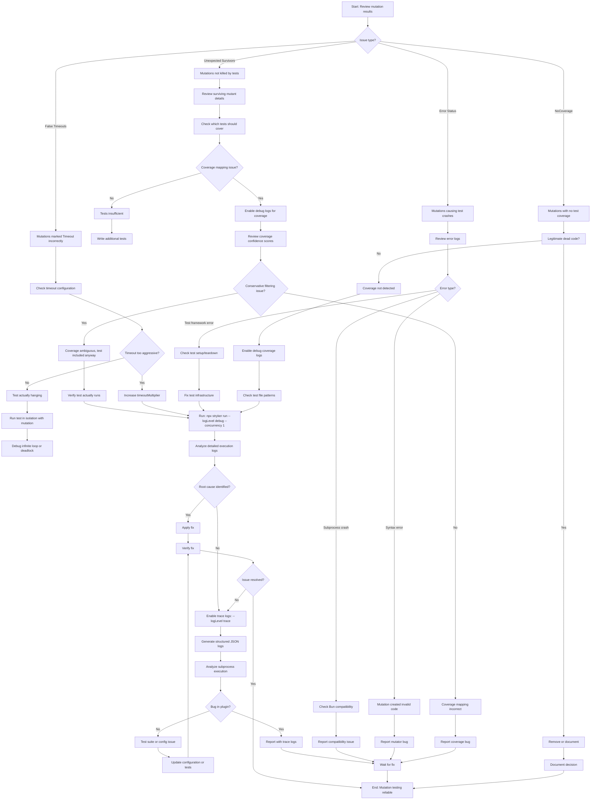
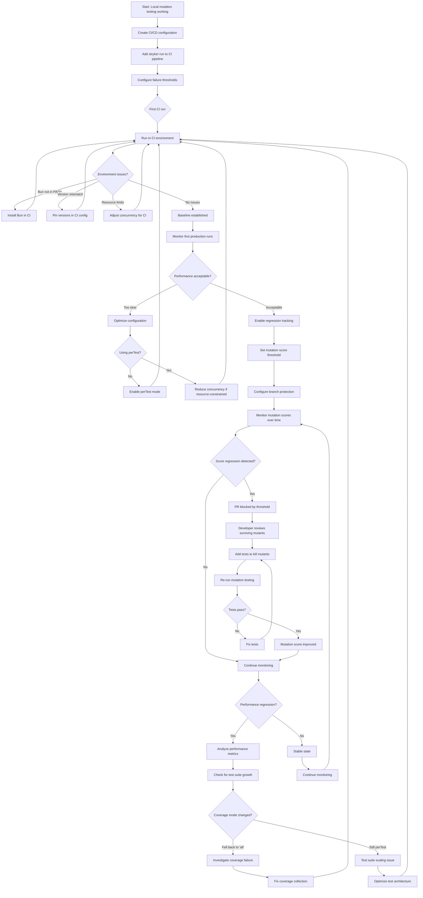

# stryker-mutator-bun-runner UX/UI Specification

_Generated on 2025-10-21 by Eduardo Menoncello_

## Executive Summary

### Project Overview

**stryker-mutator-bun-runner** is a Stryker TestRunner plugin that enables
mutation testing for projects using the Bun runtime. This CLI developer tool
integrates seamlessly into Stryker's mutation testing framework, providing
native Bun test execution with 2-3x performance improvements over Node.js-based
runners.

**Platform:** Command-Line Interface (CLI) via Stryker framework **Target
Users:** TypeScript/JavaScript developers using Bun runtime for testing
**Project Level:** 3 (Comprehensive Product) **UX Complexity:** Technical
developer tool with sophisticated configuration and debugging requirements

### UX Context for CLI Developer Tools

Unlike graphical applications, CLI tools require UX design focused on:

- **Interaction Models:** Terminal-based command execution, configuration files,
  structured output
- **Feedback Mechanisms:** Text-based progress indicators, error messages, debug
  logs
- **Discoverability:** Documentation, error guidance, IDE integration via
  schemas
- **Mental Models:** Convention over configuration, progressive disclosure of
  advanced features

### Key UX Challenges

1. **Zero-Config Simplicity:** 80% of users should succeed without configuration
   (FR036, NFR026)
2. **Error Clarity:** Error messages must be actionable with specific resolution
   steps (FR024, NFR025)
3. **Performance Transparency:** Users need visibility into where time is spent
   (dry run, coverage, mutation testing)
4. **Debug Accessibility:** Advanced troubleshooting must be available but not
   intrusive to basic usage (FR025)
5. **IDE Integration:** Configuration editing must have autocomplete support via
   JSON schema (FR006)

---

## 1. UX Goals and Principles

### 1.1 Target User Personas

#### Primary Persona: Sarah - Senior TypeScript Developer

**Background:**

- 5+ years TypeScript/JavaScript experience
- Recently adopted Bun for new projects
- Values code quality and testing
- Time-conscious (wants quick setup)

**Goals:**

- Add mutation testing to Bun projects in under 5 minutes
- Achieve 2-3x faster mutation testing than previous Jest setup
- Integrate mutation testing into CI/CD pipeline
- Understand test suite effectiveness

**Pain Points:**

- Existing mutation testing tools don't support Bun
- Performance bottlenecks in large test suites
- Complex configuration overwhelming
- Cryptic error messages waste time

**Technical Proficiency:** High - comfortable with CLI tools, TypeScript,
testing frameworks

**Usage Pattern:** Occasional interaction (setup, review results, troubleshoot
issues)

---

#### Secondary Persona: Mike - Mid-Level Developer

**Background:**

- 2-3 years development experience
- New to mutation testing concepts
- Works in complex TypeScript monorepo
- Company mandates mutation testing

**Goals:**

- Successfully set up mutation testing (first time)
- Troubleshoot configuration issues independently
- Learn mutation testing best practices
- Document setup for team

**Pain Points:**

- Unfamiliar with mutation testing workflows
- Complex project structure (monorepo, custom patterns)
- Needs clear guidance when things fail
- Unclear which configuration options are needed

**Technical Proficiency:** Medium - comfortable with basic CLI, learning
advanced concepts

**Usage Pattern:** Frequent during initial setup, then occasional maintenance

---

#### Tertiary Persona: Alex - Tech Lead

**Background:**

- 8+ years experience, team leadership role
- Manages large codebase (500+ test files)
- Performance-focused, CI/CD optimization expert
- Makes tooling decisions for team

**Goals:**

- Optimize mutation testing for large scale (1000+ mutations)
- Keep CI/CD pipeline fast (<15 minutes)
- Track performance metrics over time
- Minimize false positives/timeouts

**Pain Points:**

- Mutation testing too slow for CI/CD
- Need visibility into performance bottlenecks
- Version compatibility issues
- Resource usage concerns at scale

**Technical Proficiency:** Expert - deep CLI knowledge, performance
optimization, infrastructure

**Usage Pattern:** Strategic (performance analysis, configuration optimization,
team guidance)

### 1.2 Usability Goals

#### 1. Ease of Learning (Primary Goal for Mike)

**Target:** First-time users can successfully run mutation testing within 5
minutes without reading documentation

**Success Criteria:**

- Zero-config setup works for 80% of standard Bun projects (NFR026)
- `npx stryker init` → select bun-runner → `npx stryker run` succeeds
- Error messages guide users to solutions, not documentation
- IDE autocomplete reduces need to memorize configuration options

**Measurement:** Time-to-first-successful-run for new users

---

#### 2. Efficiency for Power Users (Primary Goal for Alex)

**Target:** Expert users can optimize performance and troubleshoot issues
without trial-and-error

**Success Criteria:**

- Debug mode provides all necessary information for diagnosis
- Performance metrics show exactly where time is spent
- Configuration allows fine-tuning (timeouts, coverage modes, test patterns)
- Structured logs enable automated analysis

**Measurement:** Time-to-resolution for configuration optimization tasks

---

#### 3. Error Prevention (Critical for All Personas)

**Target:** Users receive clear validation before problems occur

**Success Criteria:**

- Version compatibility checked at initialization (FR005, FR030)
- Configuration validated with clear error messages (FR004)
- JSON schema prevents typos during editing (FR006)
- Mutation activation verified to prevent false negatives (FR032)

**Measurement:** Percentage of runs that fail due to preventable configuration
errors (target: <5%)

---

#### 4. Clear Feedback (Essential for Sarah)

**Target:** Users always understand what the tool is doing and why

**Success Criteria:**

- Progress indicators show current phase (dry run, coverage, mutation testing)
- Performance metrics displayed after completion (NFR004, FR023)
- Error messages include: what failed, why it failed, how to fix it (FR024)
- Success states show meaningful results (mutation score, surviving mutants)

**Measurement:** User comprehension of error messages (target: 90% can resolve
without external help)

---

#### 5. Accessibility for All Skill Levels (Supporting Mike & Sarah)

**Target:** Basic usage is simple, advanced features discoverable but not
intrusive

**Success Criteria:**

- Default behavior requires zero decisions (FR036)
- Advanced features (debug logging, custom timeouts) opt-in
- Documentation layers: quick-start → configuration → troubleshooting → API
- Error messages reference relevant documentation sections

**Measurement:** Percentage of users requiring support channel assistance
(target: <10%)

### 1.3 Design Principles

#### Principle 1: Convention Over Configuration

**Definition:** Sensible defaults eliminate configuration for standard use cases

**Application:**

- Automatic test file discovery using Bun/Stryker conventions
- Auto-select coverage mode based on Bun version capabilities
- Default timeout multipliers based on dry run performance
- Zero-config works for 80% of projects (FR036)

**Trade-off:** May not fit 20% of edge cases, but those users can configure

---

#### Principle 2: Progressive Disclosure

**Definition:** Basic features are immediately visible; advanced features
revealed when needed

**Application:**

- Standard output: essential progress and results only
- Debug mode (`--logLevel debug`): detailed execution information (FR025)
- Structured logs (`--logLevel trace`): machine-parseable output
- Documentation hierarchy: quick-start before advanced configuration

**Trade-off:** Advanced users may need to search for features, but beginners
aren't overwhelmed

---

#### Principle 3: Clear, Actionable Feedback

**Definition:** Every error message provides specific next steps, not just
problem description

**Application:**

- "Bun not found in PATH" → "Install Bun from https://bun.sh or ensure it's in
  PATH"
- "Coverage collection failed" → "Upgrade Bun to 1.0.15+ or set
  coverageAnalysis: 'all'"
- "Test timeout" → "Increase timeoutMultiplier or check for infinite loops in
  [test-name]"
- Error codes enable quick documentation lookup

**Trade-off:** More verbose error messages, but dramatically faster resolution

---

#### Principle 4: Performance Transparency

**Definition:** Users see where time is spent and can make informed optimization
decisions

**Application:**

- Metrics breakdown: dry run time, coverage time, mutation testing time (FR023)
- PerTest coverage shows test count reduction (e.g., "Running 5/50 tests for
  mutant 23")
- Performance comparison when switching coverage modes
- Timeout analysis helps identify slow tests

**Trade-off:** More output, but enables data-driven optimization

---

#### Principle 5: Developer Empowerment

**Definition:** Provide tools for self-diagnosis; assume users are capable
developers

**Application:**

- Debug logging shows subprocess commands, output, and decisions (FR025)
- Structured logs enable scripted analysis and monitoring
- Configuration schema allows programmatic validation
- Error sanitization preserves debugging context while protecting secrets
  (FR037)

**Trade-off:** More complex debugging surface, but reduces dependency on
maintainer support

---

## 2. Information Architecture

### 2.1 Command Structure and Integration Points

Since this is a Stryker plugin, the primary interaction model flows through
Stryker's CLI. The "site map" for a CLI tool represents command hierarchy and
configuration structure.

#### Primary Command Flow

```
npx stryker init                  # Initial setup (Stryker built-in)
  └─> Select test runner
      └─> bun-runner              # Plugin discovered and configured
          └─> Generate stryker.config.json with bun-runner defaults

npx stryker run                   # Main execution command (Stryker built-in)
  ├─> Initialize bun-runner       # Plugin loaded via Stryker
  ├─> Dry run (test discovery)    # Plugin executes Bun tests
  ├─> Coverage collection         # Plugin collects perTest coverage
  └─> Mutation testing            # Plugin runs tests with mutations
      └─> Results reported        # Stryker displays mutation score
```

#### Configuration Hierarchy

```
stryker.config.json
├─ testRunner: "bun-runner"       # Plugin selection
├─ coverageAnalysis: "perTest"    # Stryker core setting
├─ timeoutMS: 60000               # Stryker core setting
├─ concurrency: 4                 # Stryker core setting
└─ bunRunner: {                   # Plugin-specific namespace
    ├─ testFilePattern: "**/*.test.ts"
    ├─ bunCliArgs: ["--preload", "./setup.ts"]
    ├─ coverageMode: "auto"       # auto | off | all | perTest
    ├─ timeoutMultiplier: 1.5
    └─ debugMode: false
   }
```

#### Output Information Hierarchy

```
Terminal Output Structure:
├─ Initialization Phase
│  ├─ Version validation (Bun, Stryker, Node)
│  ├─ Configuration summary
│  └─ Test discovery results
│
├─ Dry Run Phase
│  ├─ Progress indicator
│  ├─ Test execution summary (count, passed, failed, duration)
│  └─ Coverage collection status
│
├─ Mutation Testing Phase
│  ├─ Overall progress (X/Y mutations tested)
│  ├─ Real-time status updates (configurable verbosity)
│  └─ Performance metrics (tests/sec, estimated completion)
│
└─ Final Results
   ├─ Mutation score
   ├─ Status breakdown (Killed, Survived, Timeout, Error, NoCoverage)
   ├─ Performance summary (total time, breakdown by phase)
   └─ Surviving mutants details
```

#### Error Output Structure

```
Error Message Anatomy:
[ERROR CODE] Error Category: Specific Problem
├─ Context: What was happening when error occurred
├─ Details: Technical information (exit code, output snippets)
├─ Cause: Why this error happened
└─ Resolution: Specific steps to fix
   └─ Documentation: Link to relevant docs section
```

**Example:**

```
[BUN_NOT_FOUND] Environment Error: Bun installation not detected

Context: Attempting to validate Bun runtime during plugin initialization
Details: 'bun' command not found in PATH
Cause: Bun is not installed, or the installation directory is not in your system PATH

Resolution:
1. Install Bun: curl -fsSL https://bun.sh/install | bash
2. Or add Bun to PATH: export PATH="$HOME/.bun/bin:$PATH"
3. Verify installation: bun --version

Documentation: https://docs.stryker-mutator.io/bun-runner/#installation
```

### 2.2 Navigation and Interaction Patterns

#### User Journey Navigation Map

For CLI tools, "navigation" means how users discover and access functionality
through commands, flags, and configuration.

#### 1. Discovery Layer (How users find features)

| Feature               | Discovery Method          | Example                                                          |
| --------------------- | ------------------------- | ---------------------------------------------------------------- |
| Basic usage           | Quick-start docs          | `npx stryker run`                                                |
| Configuration options | JSON schema autocomplete  | IDE shows `bunRunner.*` options                                  |
| Debug logging         | Error message suggestion  | "Run with --logLevel debug for details"                          |
| Performance tuning    | Metrics output            | "Coverage collection took 30s. Consider coverageAnalysis: 'all'" |
| Version compatibility | Initialization validation | "Bun 0.9.x not supported. Upgrade to 1.0+"                       |

#### 2. Progressive Complexity Layers

**Layer 0: Zero Config** (Sarah's first run)

```bash
npx stryker init    # Select bun-runner
npx stryker run     # Just works
```

**Layer 1: Basic Configuration** (Mike's monorepo)

```json
{
  "testRunner": "bun-runner",
  "bunRunner": {
    "testFilePattern": "packages/*/tests/**/*.test.ts"
  }
}
```

**Layer 2: Performance Optimization** (Alex's large codebase)

```json
{
  "testRunner": "bun-runner",
  "coverageAnalysis": "perTest",
  "concurrency": 8,
  "bunRunner": {
    "coverageMode": "perTest",
    "timeoutMultiplier": 2.0,
    "debugMode": true
  }
}
```

**Layer 3: Advanced Debugging** (Alex troubleshooting)

```bash
npx stryker run --logLevel debug --concurrency 1
# Structured logs analysis
npx stryker run --logLevel trace > stryker-trace.json
```

#### 3. Feedback Navigation Patterns

**Real-time Progress** (during execution)

```
[14:32:05] Stryker 🔪 Starting mutation testing...
[14:32:05] Bun runner: Validating environment...
[14:32:05]   ✓ Bun 1.0.15 detected
[14:32:05]   ✓ 127 test files discovered
[14:32:06] Dry run: Running tests... ████████████████████ 100% (3.2s)
[14:32:06]   ✓ 127 tests passed
[14:32:07] Coverage: Collecting perTest coverage... ████████░░░ 75% (8.5s)
[14:32:15]   ✓ Coverage mapping generated (127 tests → 450 mutants)
[14:32:15] Mutation testing: Testing mutants... ██░░░░░░░░░ 15% (1m 45s elapsed, ~10m remaining)
```

**Interactive Feedback** (CLI tools can't be truly interactive in Stryker
context, but can be responsive)

- Progress bars update in real-time
- Estimated completion time recalculates
- Verbose mode shows per-mutant status
- Debug mode shows subprocess commands and output

**Post-Execution Feedback**

```
Mutation testing complete!

╔═══════════════════════════════════════════╗
║ Mutation Score: 87.3% (393/450 killed)   ║
╚═══════════════════════════════════════════╝

Status Breakdown:
  ✓ Killed:      393 (87.3%)
  ✗ Survived:     42 (9.3%)
  ⏱ Timeout:      8 (1.8%)
  ⚠ Error:        5 (1.1%)
  ○ NoCoverage:   2 (0.4%)

Performance Summary:
  Dry run:           3.2s
  Coverage:          8.5s
  Mutation testing:  12m 34s
  Total:            12m 45s

  Tests executed:    2,150 (of 57,150 possible with 'all' mode)
  Performance gain:  96.2% test reduction via perTest coverage

View detailed report: ./reports/mutation/mutation.html
```

#### 4. Configuration Access Patterns

**IDE Integration** (Primary configuration method)

```
stryker.config.json opened in VS Code
  └─> JSON schema loaded
      └─> IntelliSense shows:
          - bunRunner.testFilePattern (string)
          - bunRunner.coverageMode ("auto" | "off" | "all" | "perTest")
          - bunRunner.timeoutMultiplier (number)
          └─> Hover documentation explains each option
```

**CLI Flags** (Override configuration)

```bash
npx stryker run --logLevel debug          # Stryker flag
npx stryker run --concurrency 1           # Stryker flag (useful for debugging)
npx stryker run --coverageAnalysis all    # Stryker flag (overrides config)
```

**Environment Variables** (CI/CD automation)

```bash
STRYKER_DASHBOARD_API_KEY=xxx npm run stryker   # Stryker integration
BUN_RUNNER_DEBUG=1 npm run stryker               # Plugin-specific debug flag
```

---

## 3. User Flows

### Flow 1: First-Time Setup and Initial Run (Sarah's Journey)

**User Goal:** Install and run mutation testing for the first time in under 5
minutes

**Entry Point:** Developer has Bun project with existing tests, wants to add
mutation testing

**Prerequisites:**

- Bun 1.0+ installed
- Node.js 18+ installed (for Stryker)
- Existing test suite using `bun test`

**Flow Steps:**



**Decision Points:**

1. **Bun installation check:** Clear error with installation link if not found
2. **Test passing validation:** Must fix failing tests before mutation testing
3. **Coverage fallback:** Graceful degradation if perTest fails
4. **Score evaluation:** User decides next action based on results

**Success Criteria:**

- ✓ Setup completes in < 5 minutes (NFR024)
- ✓ Zero manual configuration required (FR036)
- ✓ Clear feedback at each phase
- ✓ Performance gain visible in results

**Error States:**

- Bun not found → Installation guidance
- Version incompatibility → Upgrade guidance with compatibility matrix
- Failing tests → Fix tests first message
- Coverage failure → Fallback with explanation

---

### Flow 2: Troubleshooting Configuration Issues (Mike's Journey)

**User Goal:** Diagnose and fix configuration problems in complex monorepo setup

**Entry Point:** Initial run fails or produces unexpected results

**Prerequisites:**

- Plugin installed
- Configuration file exists
- Error occurred during execution

**Flow Steps:**



**Decision Points:**

1. **Error classification:** Different paths for environment, config, pattern,
   coverage, timeout
2. **Debug mode decision:** When to enable detailed logging
3. **Self-service vs support:** Documentation → GitHub issues → maintainer help

**Success Criteria:**

- ✓ 90% of errors resolvable from error messages alone (NFR025)
- ✓ Debug mode provides sufficient info for diagnosis
- ✓ IDE integration catches config errors before runtime
- ✓ Resolution time < 15 minutes for common issues

**Error States:**

- Each error type has specific troubleshooting path
- Debug logs provide additional context
- Documentation linked from error messages

---

### Flow 3: Performance Optimization for Large Codebase (Alex's Journey)

**User Goal:** Reduce mutation testing time from 45 minutes to < 15 minutes for
CI/CD

**Entry Point:** Initial run works but too slow for production use

**Prerequisites:**

- Plugin working correctly
- Large test suite (500+ tests, 1000+ mutations)
- Performance baseline established

**Flow Steps:**



**Decision Points:**

1. **Phase analysis:** Identify which phase needs optimization
2. **Coverage mode:** perTest vs all (40-60% impact)
3. **Concurrency tuning:** Balance parallelism vs resource usage
4. **Acceptable performance:** Business decision on CI/CD time budget

**Success Criteria:**

- ✓ Achieve 2-3x performance improvement (NFR001)
- ✓ PerTest provides 40-60% gain (NFR003)
- ✓ Performance metrics guide decisions (FR023)
- ✓ CI/CD time < 15 minutes

**Edge Cases:**

- Bun version doesn't support coverage → Upgrade or accept 'all' mode
- Resource constraints limit concurrency → Find optimal balance
- Test suite architecture issues → Outside plugin scope

---

### Flow 4: Debugging Mutation Test Failures (All Personas)

**User Goal:** Understand why specific mutations are surviving or failing
unexpectedly

**Entry Point:** Mutation results show unexpected survivors or errors

**Flow Steps:**



**Decision Points:**

1. **Issue classification:** Survivor, timeout, error, or no coverage
2. **Debug depth:** Normal → debug → trace logs
3. **Bug vs config:** Plugin issue vs user configuration issue
4. **Resolution path:** Self-fix, configuration change, or report bug

**Success Criteria:**

- ✓ Debug logs sufficient for 90% of issues
- ✓ Single-concurrency mode isolates race conditions
- ✓ Trace logs provide complete subprocess visibility
- ✓ Error messages guide to correct diagnosis path

---

### Flow 5: CI/CD Integration and Monitoring (Alex's Journey)

**User Goal:** Integrate mutation testing into CI/CD pipeline with monitoring

**Entry Point:** Local setup working, ready for automation

**Flow Steps:**



**Decision Points:**

1. **Environment setup:** Ensure CI has all prerequisites
2. **Performance tuning:** Balance speed vs thoroughness for CI
3. **Threshold setting:** Appropriate mutation score requirement
4. **Regression response:** How to handle score/performance drops

**Success Criteria:**

- ✓ CI runs reliably without environment issues
- ✓ Performance suitable for blocking PRs (NFR004)
- ✓ Thresholds catch test quality regressions
- ✓ Metrics enable proactive optimization

**Edge Cases:**

- CI resource constraints → Lower concurrency
- Intermittent failures → Retry logic needed
- Coverage breaks in CI → Fallback to 'all' mode acceptable
- Performance degrades → Alerting and investigation flow

---

## 4. Component Library and Design System

### 4.1 Design System Approach

#### CLI Design System Philosophy

For a CLI tool integrated into the Stryker framework, the "design system"
consists of:

- **Output formatting standards** (consistent message structure)
- **Terminal UI components** (progress bars, status indicators, tables)
- **Error message templates** (standardized error anatomy)
- **Log format patterns** (structured, parseable output)

**Primary Constraint:** Must integrate seamlessly with Stryker's existing output
style while maintaining distinct plugin identity.

#### Design System Strategy

**Hybrid Approach:**

- **Inherit from Stryker:** Use Stryker's logging framework and output
  formatting where possible
- **Extend for plugin-specific needs:** Add Bun runner-specific components
  (coverage feedback, performance metrics)
- **Standard CLI patterns:** Follow Unix/POSIX conventions for exit codes,
  signals, output streams

**Technology Foundation:**

- **Logging:** Stryker's logger API (via dependency injection)
- **Progress Indicators:** CLI progress bars (using standard libraries like
  `cli-progress`)
- **Output Formatting:** ANSI color codes, box-drawing characters for tables
- **Structured Output:** JSON for trace/debug mode (machine-readable)

#### Component Hierarchy

```
Stryker CLI Output Framework (inherited)
├─ Standard Stryker Reporters (HTML, JSON, console)
└─ Plugin Logger Integration
    └─ Bun Runner Output Components (custom)
        ├─ Validation Messages
        ├─ Progress Indicators
        ├─ Performance Metrics
        ├─ Error Templates
        └─ Debug/Trace Logs
```

### 4.2 Core Components

#### Component 1: Status Indicator

**Purpose:** Communicate validation results, phase completion, and state changes

**Variants:**

- ✓ Success (green checkmark)
- ✗ Failure (red X)
- ⚠ Warning (yellow warning triangle)
- ℹ Info (blue info icon)
- ⏱ Timeout (clock icon)
- ○ No coverage (circle)

**States:**

- Default: Icon + message on single line
- Verbose: Icon + message + details on multiple lines
- Silent: No output (only in silent mode)

**Usage:**

```
✓ Bun 1.0.15 detected
✓ 127 test files discovered
✓ Coverage mapping generated (127 tests → 450 mutants)
⚠ Coverage collection failed, falling back to 'all' mode
✗ Bun installation not found
```

**API Example:**

```typescript
logger.info('✓ Coverage mapping generated (127 tests → 450 mutants)');
logger.warn("⚠ Coverage collection failed, falling back to 'all' mode");
logger.error('✗ Bun installation not found');
```

---

#### Component 2: Progress Bar

**Purpose:** Show real-time progress for long-running operations

**Variants:**

- Standard progress (percentage + bar)
- Timed progress (percentage + bar + elapsed + remaining)
- Spinner (indeterminate progress)

**States:**

- Running: Animated bar/spinner
- Complete: Full bar with checkmark
- Failed: Partial bar with error indicator
- Paused: Bar frozen (not applicable for this plugin)

**Usage:**

```
Dry run: Running tests... ████████████████████ 100% (3.2s)
Coverage: Collecting perTest coverage... ████████░░░ 75% (8.5s elapsed)
Mutation testing: Testing mutants... ██░░░░░░░░░ 15% (1m 45s / ~10m)
```

**Implementation:**

```typescript
const progressBar = new ProgressBar({
  format:
    'Mutation testing: Testing mutants... {bar} {percentage}% ({duration} / ~{eta})',
  total: totalMutants,
});
```

---

#### Component 3: Error Message Template

**Purpose:** Provide actionable error information with consistent structure

**Anatomy:**

```
[ERROR_CODE] Category: Specific Problem

Context: What was happening
Details: Technical information
Cause: Why this happened

Resolution:
1. Step one
2. Step two
3. Step three

Documentation: https://link-to-docs
```

**Variants:**

- Environment errors (Bun not found, version incompatible)
- Configuration errors (invalid schema, missing fields)
- Runtime errors (subprocess crash, timeout)
- Coverage errors (collection failed, mapping invalid)

**States:**

- Normal: Full error template
- Debug: Includes stack trace and subprocess output
- Trace: Includes complete subprocess command and environment

**Example Implementation:**

```typescript
class BunRunnerError {
  constructor(
    public code: string,
    public category: string,
    public problem: string,
    public context: string,
    public details: string,
    public cause: string,
    public resolution: string[],
    public docsUrl?: string
  ) {}

  format(): string {
    return `
[${this.code}] ${this.category}: ${this.problem}

Context: ${this.context}
Details: ${this.details}
Cause: ${this.cause}

Resolution:
${this.resolution.map((step, i) => `${i + 1}. ${step}`).join('\n')}

${this.docsUrl ? `Documentation: ${this.docsUrl}` : ''}
`.trim();
  }
}
```

**Error Code Categories:**

- `ENV_*`: Environment errors (BUN_NOT_FOUND, VERSION_MISMATCH)
- `CFG_*`: Configuration errors (INVALID_SCHEMA, MISSING_FIELD)
- `RUN_*`: Runtime errors (SUBPROCESS_CRASH, TEST_TIMEOUT)
- `COV_*`: Coverage errors (COLLECTION_FAILED, MAPPING_INVALID)

---

#### Component 4: Performance Metrics Table

**Purpose:** Display performance breakdown after execution

**Structure:**

```
Performance Summary:
  Dry run:           3.2s
  Coverage:          8.5s
  Mutation testing:  12m 34s
  Total:            12m 45s

  Tests executed:    2,150 (of 57,150 possible)
  Performance gain:  96.2% test reduction via perTest
```

**Variants:**

- Compact: Single-line summary
- Standard: Multi-line breakdown (shown above)
- Detailed: Includes per-phase metrics and percentages

**States:**

- Complete: All phases shown
- Partial: Only completed phases shown (if interrupted)
- Comparison: Side-by-side with previous run (optional)

**Implementation:**

```typescript
interface PerformanceMetrics {
  dryRunTime: number;
  coverageTime: number;
  mutationTime: number;
  totalTime: number;
  testsExecuted: number;
  totalPossibleTests: number;
}

function formatMetrics(metrics: PerformanceMetrics): string {
  const gain = (
    (1 - metrics.testsExecuted / metrics.totalPossibleTests) *
    100
  ).toFixed(1);
  return `
Performance Summary:
  Dry run:           ${formatDuration(metrics.dryRunTime)}
  Coverage:          ${formatDuration(metrics.coverageTime)}
  Mutation testing:  ${formatDuration(metrics.mutationTime)}
  Total:            ${formatDuration(metrics.totalTime)}

  Tests executed:    ${metrics.testsExecuted.toLocaleString()} (of ${metrics.totalPossibleTests.toLocaleString()} possible)
  Performance gain:  ${gain}% test reduction via perTest
`.trim();
}
```

---

#### Component 5: Mutation Results Summary

**Purpose:** Display final mutation testing results with status breakdown

**Structure:**

```
╔═══════════════════════════════════════════╗
║ Mutation Score: 87.3% (393/450 killed)   ║
╚═══════════════════════════════════════════╝

Status Breakdown:
  ✓ Killed:      393 (87.3%)
  ✗ Survived:     42 (9.3%)
  ⏱ Timeout:      8 (1.8%)
  ⚠ Error:        5 (1.1%)
  ○ NoCoverage:   2 (0.4%)
```

**Variants:**

- Success (score ≥ threshold): Green border, positive messaging
- Warning (score < threshold but > 50%): Yellow border, improvement suggestions
- Failure (score ≤ 50%): Red border, test quality concerns

**States:**

- Complete: All mutants tested
- Partial: Some mutants skipped (with explanation)
- Interrupted: Run stopped early (resume guidance)

**Implementation:**

```typescript
interface MutationResults {
  killed: number;
  survived: number;
  timeout: number;
  error: number;
  noCoverage: number;
  total: number;
  threshold?: number;
}

function formatResults(results: MutationResults): string {
  const score = ((results.killed / results.total) * 100).toFixed(1);
  const passedThreshold =
    !results.threshold || parseFloat(score) >= results.threshold;

  const border = passedThreshold ? '═' : '─';
  const corner = passedThreshold ? '╔╗╚╝' : '┌┐└┘';

  return `
${corner[0]}${border.repeat(45)}${corner[1]}
║ Mutation Score: ${score}% (${results.killed}/${results.total} killed) ${passedThreshold ? '✓' : '✗'}
${corner[2]}${border.repeat(45)}${corner[3]}

Status Breakdown:
  ✓ Killed:      ${results.killed} (${((results.killed / results.total) * 100).toFixed(1)}%)
  ✗ Survived:    ${results.survived} (${((results.survived / results.total) * 100).toFixed(1)}%)
  ⏱ Timeout:     ${results.timeout} (${((results.timeout / results.total) * 100).toFixed(1)}%)
  ⚠ Error:       ${results.error} (${((results.error / results.total) * 100).toFixed(1)}%)
  ○ NoCoverage:  ${results.noCoverage} (${((results.noCoverage / results.total) * 100).toFixed(1)}%)
`.trim();
}
```

---

#### Component 6: Debug Log Entry

**Purpose:** Structured debug output for troubleshooting

**Variants:**

- Normal log: Timestamped message
- Subprocess log: Command + output + exit code
- Coverage log: Test-to-mutant mapping details
- Performance log: Timing breakdowns

**States:**

- Info: Standard information
- Debug: Detailed execution information
- Trace: Complete subprocess and state dumps

**Format:**

```
[14:32:15] [DEBUG] Spawning Bun subprocess
  Command: bun test --coverage
  Cwd: /path/to/project
  Env: MUTATION_ID=42
[14:32:16] [DEBUG] Subprocess output:
  stdout: <test output>
  stderr: <empty>
  exit code: 0
[14:32:16] [TRACE] Coverage data:
  {
    "test1": ["file.ts:10-15", "file.ts:20-25"],
    "test2": ["file.ts:15-20"]
  }
```

**Implementation:**

```typescript
class DebugLogger {
  logSubprocess(cmd: string, cwd: string, env: Record<string, string>) {
    if (this.level >= LogLevel.Debug) {
      this.log('DEBUG', `Spawning Bun subprocess`);
      this.log('DEBUG', `  Command: ${cmd}`);
      this.log('DEBUG', `  Cwd: ${cwd}`);
      this.log('DEBUG', `  Env: ${this.sanitize(env)}`);
    }
  }

  logSubprocessResult(stdout: string, stderr: string, exitCode: number) {
    if (this.level >= LogLevel.Debug) {
      this.log('DEBUG', `Subprocess output:`);
      this.log('DEBUG', `  stdout: ${this.truncate(stdout)}`);
      this.log('DEBUG', `  stderr: ${stderr || '<empty>'}`);
      this.log('DEBUG', `  exit code: ${exitCode}`);
    }
  }

  logCoverageData(coverage: CoverageData) {
    if (this.level >= LogLevel.Trace) {
      this.log('TRACE', `Coverage data:`);
      this.log('TRACE', JSON.stringify(coverage, null, 2));
    }
  }
}
```

---

#### Component 7: Configuration Validation Message

**Purpose:** Provide feedback during configuration validation

**Variants:**

- Schema validation errors (JSON schema violations)
- Semantic validation warnings (deprecated options, suboptimal settings)
- Auto-correction notices (defaults applied, fallbacks activated)

**Usage:**

```
✓ Configuration loaded from stryker.config.json
⚠ bunRunner.testFilePattern not set, using default: **/*.test.{ts,tsx,js,jsx}
⚠ Bun 1.0.12 detected, coverage may be unstable. Recommended: 1.0.15+
ℹ coverageMode set to 'auto', will detect best mode at runtime
```

**States:**

- Valid: All checks passed
- Warning: Valid but suboptimal
- Invalid: Configuration cannot be used (errors must be fixed)

---

#### Component Naming Conventions

**Terminal Output:**

- Use Unicode symbols consistently (✓ ✗ ⚠ ℹ ⏱ ○)
- Timestamps in `[HH:MM:SS]` format for normal output
- ISO 8601 for structured logs: `2025-10-21T14:32:15.123Z`

**Colors (via ANSI codes):**

- Green: Success, positive metrics
- Red: Errors, critical warnings
- Yellow: Warnings, suggestions
- Blue: Info, neutral status
- Gray: Debug information, less important details

**Box Drawing:**

- `═ ║ ╔ ╗ ╚ ╝` for strong emphasis (mutation score)
- `─ │ ┌ ┐ └ ┘` for standard tables
- `░ ▒ ▓ █` for progress bars

**Accessibility Considerations:**

- Don't rely solely on color (use symbols + color)
- Support `NO_COLOR` environment variable
- Structured logs work without ANSI codes
- Screen reader friendly (symbols have meaning without visual rendering)

---

## 5. Visual Design Foundation

### 5.1 Color Palette

#### Terminal Color Strategy

CLI tools must work across diverse terminal environments (dark/light themes,
limited color support, screen readers). The color palette uses standard ANSI
colors with semantic meanings.

#### Primary Color Palette (ANSI)

| Color      | ANSI Code  | Usage                                        | Semantic Meaning                      |
| ---------- | ---------- | -------------------------------------------- | ------------------------------------- |
| **Green**  | `\x1b[32m` | Success states, positive metrics, checkmarks | ✓ Passed, completed successfully      |
| **Red**    | `\x1b[31m` | Errors, failures, critical warnings          | ✗ Failed, requires attention          |
| **Yellow** | `\x1b[33m` | Warnings, suggestions, fallbacks             | ⚠ Caution, suboptimal but functional |
| **Blue**   | `\x1b[34m` | Info messages, neutral status                | ℹ Information, no action required    |
| **Cyan**   | `\x1b[36m` | Links, documentation references              | Documentation, external resources     |
| **Gray**   | `\x1b[90m` | Debug output, less important info            | Secondary information                 |
| **White**  | `\x1b[37m` | Primary text, default output                 | Standard output                       |

#### Semantic Color Application

**Success Flow:**

```
✓ Bun 1.0.15 detected                          [Green]
✓ Coverage mapping generated                   [Green]
Mutation Score: 87.3% (393/450 killed)         [Green if ≥ threshold]
```

**Warning Flow:**

```
⚠ Coverage collection failed                   [Yellow]
⚠ Falling back to 'all' mode                   [Yellow]
ℹ Performance will be reduced                  [Blue]
```

**Error Flow:**

```
✗ Bun installation not found                   [Red]
[ENV_BUN_NOT_FOUND] Environment Error          [Red]
Resolution: Install Bun from https://bun.sh    [Cyan for URL]
```

**Debug Flow:**

```
[14:32:15] [DEBUG] Spawning subprocess         [Gray]
  Command: bun test --coverage                 [Gray]
  stdout: <output>                             [Gray]
```

#### Color Usage Rules

1. **Never rely solely on color** - Always pair with symbols (✓ ✗ ⚠)
2. **Support NO_COLOR** - Respect `NO_COLOR` environment variable (strips all
   ANSI codes)
3. **Degrade gracefully** - Output readable without color support
4. **Contrast requirements** - Ensure readability on both dark and light
   terminals
5. **Accessibility** - Symbols and text convey same information as color

#### Implementation

```typescript
enum Color {
  Green = '\x1b[32m',
  Red = '\x1b[31m',
  Yellow = '\x1b[33m',
  Blue = '\x1b[34m',
  Cyan = '\x1b[36m',
  Gray = '\x1b[90m',
  White = '\x1b[37m',
  Reset = '\x1b[0m',
}

class ColorFormatter {
  constructor(private enabled: boolean = !process.env.NO_COLOR) {}

  success(text: string): string {
    return this.enabled ? `${Color.Green}${text}${Color.Reset}` : text;
  }

  error(text: string): string {
    return this.enabled ? `${Color.Red}${text}${Color.Reset}` : text;
  }

  warn(text: string): string {
    return this.enabled ? `${Color.Yellow}${text}${Color.Reset}` : text;
  }

  info(text: string): string {
    return this.enabled ? `${Color.Blue}${text}${Color.Reset}` : text;
  }

  link(text: string): string {
    return this.enabled ? `${Color.Cyan}${text}${Color.Reset}` : text;
  }

  debug(text: string): string {
    return this.enabled ? `${Color.Gray}${text}${Color.Reset}` : text;
  }
}
```

### 5.2 Typography

#### Font Families

CLI tools use monospace fonts provided by the terminal emulator. The plugin
cannot control font choice but should design output assuming monospace
characteristics.

**Expected Terminal Fonts:**

- **macOS:** SF Mono, Menlo
- **Linux:** DejaVu Sans Mono, Liberation Mono, Consolas
- **Windows:** Consolas, Courier New

**Design Assumptions:**

- All characters have equal width (monospace)
- Box-drawing characters (─ │ ┌) align properly
- Unicode symbols (✓ ✗ ⚠) may have varying width support

**Font Fallback Strategy:**

- Use ASCII alternatives if Unicode not supported
- Detect terminal capabilities via environment or testing
- Provide plain text mode for minimal terminals

#### Type Hierarchy (Semantic, not visual size)

| Level                  | Usage             | Visual Treatment                   | Example                            |
| ---------------------- | ----------------- | ---------------------------------- | ---------------------------------- |
| **H1 - Major Section** | Phase headers     | Box borders, spacing               | `╔═══════ Mutation Score ═══════╗` |
| **H2 - Subsection**    | Category headers  | All caps or bold                   | `STATUS BREAKDOWN:`                |
| **Body - Standard**    | Primary content   | Normal weight                      | `✓ 127 test files discovered`      |
| **Detail - Secondary** | Supplemental info | Indented, gray color               | `  Command: bun test --coverage`   |
| **Code - Monospace**   | Commands, paths   | Backticks in docs, raw in terminal | `npx stryker run`                  |

**Visual Emphasis Techniques:**

Since terminals don't support font size changes, use:

- **UPPERCASE** for headers
- **Indentation** for hierarchy
- **Box drawing** for emphasis
- **Spacing** for separation
- **Color** for state (with symbol backup)

#### Type Scale (Spacing-based)

```
Major Section (H1):
[blank line]
╔═══════════════════════════════════════════╗
║ Mutation Score: 87.3% (393/450 killed)   ║
╚═══════════════════════════════════════════╝
[blank line]

Subsection (H2):
[blank line]
Performance Summary:
[content]

Body (Standard):
✓ Coverage mapping generated (127 tests → 450 mutants)

Detail (Secondary):
  Command: bun test --coverage
  Exit code: 0
```

### 5.3 Spacing and Layout

#### Spacing System

Terminal output uses character-based spacing (not pixels). The spacing system
defines vertical and horizontal rhythm.

**Vertical Spacing:**

- **0 lines** - Related items (status breakdown entries)
- **1 line** - Logical groups (sections within a phase)
- **2 lines** - Major sections (between phases)

**Horizontal Spacing:**

- **0 spaces** - Continuous text
- **2 spaces** - Indentation level 1 (details, sub-items)
- **4 spaces** - Indentation level 2 (nested details)
- **Aligned columns** - Use padding to align values

#### Layout Grid

Terminal layout uses a character grid (typically 80 or 120 columns wide).

**Design Constraints:**

- **Minimum width:** 80 characters (standard terminal)
- **Comfortable width:** 120 characters (modern terminals)
- **Maximum width:** Content should wrap or scroll beyond 120

**Layout Examples:**

**Compact Layout (80 columns):**

```
╔═══════════════════════════════════════════╗
║ Mutation Score: 87.3% (393/450 killed)   ║
╚═══════════════════════════════════════════╝

Status Breakdown:
  ✓ Killed:      393 (87.3%)
  ✗ Survived:     42 (9.3%)
  ⏱ Timeout:      8 (1.8%)
```

**Wide Layout (120 columns):**

```
╔═══════════════════════════════════════════════════════════════════════════════════════════════════════════╗
║ Mutation Score: 87.3% (393/450 killed) ✓                                                                 ║
╚═══════════════════════════════════════════════════════════════════════════════════════════════════════════╝

Status Breakdown:                              Performance Summary:
  ✓ Killed:      393 (87.3%)                     Dry run:           3.2s
  ✗ Survived:     42 (9.3%)                      Coverage:          8.5s
  ⏱ Timeout:      8 (1.8%)                       Mutation testing:  12m 34s
```

#### Alignment Patterns

**Left-aligned (default):**

```
✓ Bun 1.0.15 detected
✓ 127 test files discovered
✓ Coverage mapping generated
```

**Right-aligned (metrics):**

```
Dry run:               3.2s
Coverage:              8.5s
Mutation testing:  12m 34s
```

**Column-aligned (tables):**

```
Status      Count    Percentage
Killed        393        87.3%
Survived       42         9.3%
Timeout         8         1.8%
```

#### Layout Implementation

```typescript
class LayoutFormatter {
  private readonly maxWidth: number = 120;
  private readonly minWidth: number = 80;

  alignRight(label: string, value: string, width: number = 40): string {
    const padding = width - label.length - value.length;
    return `${label}${' '.repeat(Math.max(padding, 1))}${value}`;
  }

  createTable(
    rows: Array<{ label: string; count: number; percentage: number }>
  ): string {
    const lines = [
      'Status        Count    Percentage',
      '─────────────────────────────────',
    ];

    rows.forEach(row => {
      const label = row.label.padEnd(12);
      const count = row.count.toString().padStart(6);
      const pct = `${row.percentage.toFixed(1)}%`.padStart(10);
      lines.push(`${label}${count}    ${pct}`);
    });

    return lines.join('\n');
  }

  wrapText(text: string, maxWidth: number = this.maxWidth): string {
    const words = text.split(' ');
    const lines: string[] = [];
    let currentLine = '';

    words.forEach(word => {
      if ((currentLine + word).length > maxWidth) {
        lines.push(currentLine.trim());
        currentLine = word + ' ';
      } else {
        currentLine += word + ' ';
      }
    });

    if (currentLine) {
      lines.push(currentLine.trim());
    }

    return lines.join('\n');
  }

  verticalSpace(lines: number = 1): string {
    return '\n'.repeat(lines);
  }

  indent(text: string, level: number = 1): string {
    const spaces = '  '.repeat(level);
    return text
      .split('\n')
      .map(line => spaces + line)
      .join('\n');
  }
}
```

#### Responsive Behavior

Since terminal width can vary, the output should adapt:

**Wide terminal (≥120 columns):**

- Two-column layouts for metrics
- Full-width tables
- Expanded progress bars

**Standard terminal (80-119 columns):**

- Single-column layouts
- Compact tables
- Standard progress bars

**Narrow terminal (<80 columns):**

- Simplified output
- Abbreviated labels
- Wrap long lines

**Detection:**

```typescript
const terminalWidth = process.stdout.columns || 80;

if (terminalWidth >= 120) {
  // Wide layout
} else if (terminalWidth >= 80) {
  // Standard layout
} else {
  // Compact layout
}
```

#### Box Drawing Reference

**Characters Used:**

```
╔═╗  ┌─┐  Strong vs standard headers
║ ║  │ │  Vertical borders
╚═╝  └─┘  Bottom borders
─    ─    Horizontal rules
█▓▒░      Progress bar characters (filled to empty)
```

**Usage Guidelines:**

- Strong borders (`╔═╗`) for final results, critical information
- Standard borders (`┌─┐`) for tables, secondary information
- Horizontal rules (`─`) for separators
- Progress bars use gradient: `█` (full) to `░` (empty)

---

## 6. Responsive Design

### 6.1 Breakpoints (Terminal Width Adaptation)

Unlike web applications with pixel-based breakpoints, CLI tools adapt to
character-based terminal widths. The plugin detects terminal width and adjusts
output formatting accordingly.

#### Terminal Width Breakpoints

| Breakpoint          | Width (columns) | Target Scenario                 | Layout Strategy              |
| ------------------- | --------------- | ------------------------------- | ---------------------------- |
| **XS - Minimal**    | < 80            | Embedded terminals, mobile SSH  | Simplified, vertical-only    |
| **S - Standard**    | 80-99           | Traditional 80-column terminals | Single-column, compact       |
| **M - Comfortable** | 100-119         | Modern default terminals        | Single-column, expanded      |
| **L - Wide**        | 120-159         | Developer workstations          | Two-column where beneficial  |
| **XL - Ultra-wide** | ≥ 160           | Ultra-wide monitors             | Multi-column, detailed views |

#### Detection Implementation

```typescript
class ResponsiveFormatter {
  private width: number;

  constructor() {
    // Detect terminal width, fallback to 80
    this.width = process.stdout.columns || 80;
  }

  getBreakpoint(): 'xs' | 's' | 'm' | 'l' | 'xl' {
    if (this.width < 80) return 'xs';
    if (this.width < 100) return 's';
    if (this.width < 120) return 'm';
    if (this.width < 160) return 'l';
    return 'xl';
  }

  shouldUseCompactLayout(): boolean {
    return this.width < 100;
  }

  shouldUseTwoColumns(): boolean {
    return this.width >= 120;
  }

  getProgressBarWidth(): number {
    if (this.width < 80) return 20;
    if (this.width < 120) return 30;
    return 40;
  }
}
```

### 6.2 Adaptation Patterns

#### Pattern 1: Progress Bar Scaling

**XS/S (< 100 columns):**

```
Mutation: ████░░░░░░ 45%
```

**M (100-119 columns):**

```
Mutation testing: ████████████░░░░░░░░░░░░░░░░░░ 45% (2m 15s / ~5m)
```

**L/XL (≥ 120 columns):**

```
Mutation testing: Testing mutants... ████████████████████░░░░░░░░░░░░░░░░░░░░ 45% (2m 15s elapsed / ~5m remaining)
```

#### Pattern 2: Results Summary Layout

**XS/S (< 100 columns):**

```
Score: 87.3% (393/450)

✓ Killed:    393
✗ Survived:   42
⏱ Timeout:    8
⚠ Error:      5
○ NoCoverage: 2
```

**M (100-119 columns):**

```
╔═══════════════════════════════════════════╗
║ Mutation Score: 87.3% (393/450 killed)   ║
╚═══════════════════════════════════════════╝

Status Breakdown:
  ✓ Killed:      393 (87.3%)
  ✗ Survived:     42 (9.3%)
  ⏱ Timeout:      8 (1.8%)
  ⚠ Error:        5 (1.1%)
  ○ NoCoverage:   2 (0.4%)
```

**L/XL (≥ 120 columns):**

```
╔═══════════════════════════════════════════════════════════════════════════════════════════════════╗
║ Mutation Score: 87.3% (393/450 killed) ✓                                                         ║
╚═══════════════════════════════════════════════════════════════════════════════════════════════════╝

Status Breakdown:                              Performance Summary:
  ✓ Killed:      393 (87.3%)                     Dry run:           3.2s
  ✗ Survived:     42 (9.3%)                      Coverage:          8.5s
  ⏱ Timeout:      8 (1.8%)                       Mutation testing:  12m 34s
  ⚠ Error:        5 (1.1%)                       Total:            12m 45s
  ○ NoCoverage:   2 (0.4%)
```

#### Pattern 3: Error Message Adaptation

**XS/S (< 100 columns):**

```
[ENV_BUN_NOT_FOUND] Error

Bun not found in PATH

Fix:
1. Install: curl -fsSL
   https://bun.sh/install | bash
2. Add to PATH
3. Verify: bun --version

Docs: [shortened URL]
```

**M+ (≥ 100 columns):**

```
[ENV_BUN_NOT_FOUND] Environment Error: Bun installation not detected

Context: Attempting to validate Bun runtime during plugin initialization
Details: 'bun' command not found in PATH
Cause: Bun is not installed, or the installation directory is not in your system PATH

Resolution:
1. Install Bun: curl -fsSL https://bun.sh/install | bash
2. Or add Bun to PATH: export PATH="$HOME/.bun/bin:$PATH"
3. Verify installation: bun --version

Documentation: https://docs.stryker-mutator.io/bun-runner/#installation
```

#### Pattern 4: Table Adaptation

**XS (< 80 columns):**

```
Killed:   393 (87.3%)
Survived:  42 (9.3%)
Timeout:    8 (1.8%)
```

**S/M (80-119 columns):**

```
Status        Count    Percentage
─────────────────────────────────
Killed          393        87.3%
Survived         42         9.3%
Timeout           8         1.8%
```

**L/XL (≥ 120 columns):**

```
Status            Count      Percentage      Description
──────────────────────────────────────────────────────────────────
Killed              393          87.3%      Test failures detected mutation
Survived             42           9.3%      Tests passed with mutation active
Timeout               8           1.8%      Tests exceeded timeout threshold
```

#### Responsive Formatting Implementation

```typescript
class AdaptiveOutput {
  constructor(private formatter: ResponsiveFormatter) {}

  formatResults(results: MutationResults): string {
    const breakpoint = this.formatter.getBreakpoint();

    switch (breakpoint) {
      case 'xs':
        return this.formatResultsCompact(results);
      case 's':
      case 'm':
        return this.formatResultsStandard(results);
      case 'l':
      case 'xl':
        return this.formatResultsWide(results);
    }
  }

  private formatResultsCompact(results: MutationResults): string {
    const score = ((results.killed / results.total) * 100).toFixed(1);
    return `
Score: ${score}% (${results.killed}/${results.total})

✓ Killed:    ${results.killed}
✗ Survived:  ${results.survived}
⏱ Timeout:   ${results.timeout}
⚠ Error:     ${results.error}
○ NoCoverage: ${results.noCoverage}
`.trim();
  }

  private formatResultsStandard(results: MutationResults): string {
    // Standard format (shown in previous examples)
  }

  private formatResultsWide(results: MutationResults): string {
    // Two-column format (shown in previous examples)
  }
}
```

---

## 7. Accessibility

### 7.1 Compliance Target

**Target Standard:** CLI Accessibility Best Practices + WCAG 2.1 Principles
(adapted for terminal context)

Since WCAG is designed for web content, we adapt its principles to CLI tools:

| WCAG Principle     | CLI Adaptation                                             | Implementation                                            |
| ------------------ | ---------------------------------------------------------- | --------------------------------------------------------- |
| **Perceivable**    | Information available through text, not just visual        | Symbols + color, NO_COLOR support, structured logs        |
| **Operable**       | Works with keyboard, screen readers, alternative terminals | Keyboard-only (no mouse), screen reader compatible output |
| **Understandable** | Clear language, predictable behavior                       | Consistent patterns, actionable errors                    |
| **Robust**         | Works across terminal emulators and assistive tech         | ANSI fallbacks, plain text mode, semantic markup          |

**Compliance Level:** Best-effort WCAG 2.1 Level AA equivalency for CLI tools

### 7.2 Key Requirements

#### Requirement 1: Color Independence (WCAG 1.4.1)

**Principle:** Never rely solely on color to convey information

**Implementation:**

- All status indicated by symbol + color (✓ ✗ ⚠)
- Error messages include error codes, not just red text
- Progress shown with bar + percentage, not just color gradient

**Example:**

```typescript
// Good: Symbol + color
logger.info('✓ Coverage mapping generated'); // Green + checkmark

// Bad: Color only (don't do this)
logger.info('Coverage mapping generated'); // Green but no symbol
```

**Testing:** Run with `NO_COLOR=1` and verify all information still
comprehensible

---

#### Requirement 2: NO_COLOR Support (Community Standard)

**Principle:** Respect `NO_COLOR` environment variable

**Implementation:**

```typescript
const useColor = !process.env.NO_COLOR && process.stdout.isTTY;

class ColorFormatter {
  constructor(private enabled: boolean = useColor) {}

  // ... color methods check this.enabled
}
```

**Testing:**

```bash
NO_COLOR=1 npx stryker run
# All output should be readable without color codes
```

---

#### Requirement 3: Screen Reader Compatibility

**Principle:** Output should be intelligible when read linearly by screen
readers

**Implementation:**

- Avoid ASCII art that doesn't make sense when read aloud
- Use semantic structure (headers, lists)
- Provide alt-text equivalents for complex symbols

**Good Practice:**

```
Mutation Score: 87.3% (393 of 450 killed)

Status Breakdown:
  Killed: 393 (87.3%)
  Survived: 42 (9.3%)
```

**Poor Practice (screen reader unfriendly):**

```
╔═══════════════════════════════════════════╗
║ 87.3% ████████████████████░░░░ 393/450   ║
╚═══════════════════════════════════════════╝
```

**Balance:** Use visual enhancements but ensure core info readable without them

---

#### Requirement 4: Keyboard-Only Operation

**Principle:** All functionality accessible via keyboard (no mouse required)

**Implementation:**

- CLI tools are inherently keyboard-only (no mouse needed) ✓
- No interactive menus that require arrow keys (Stryker handles all interaction)
- All operations via command-line arguments and configuration files

**Compliance:** Inherently met by CLI nature

---

#### Requirement 5: Contrast and Readability

**Principle:** Terminal output readable in both dark and light themes

**Implementation:**

- Use ANSI standard colors (work in both themes)
- Test with common terminal color schemes
- Avoid custom color codes that assume theme

**Testing Scenarios:**

- Dark theme (white on black)
- Light theme (black on white)
- High contrast themes
- Monochrome terminals

---

#### Requirement 6: Structured Alternative Output

**Principle:** Provide machine-readable alternative to visual output

**Implementation:**

```bash
# Human-friendly output (default)
npx stryker run

# Machine-readable JSON output (for automation)
npx stryker run --logLevel trace > output.json

# Plain text (no formatting)
NO_COLOR=1 npx stryker run --reporters clear-text
```

**JSON Structure:**

```json
{
  "timestamp": "2025-10-21T14:32:15.123Z",
  "phase": "mutation-testing",
  "event": "mutant-tested",
  "data": {
    "mutantId": 42,
    "status": "Killed",
    "duration": 1234
  }
}
```

---

#### Requirement 7: Error Message Clarity (WCAG 3.3.1, 3.3.3)

**Principle:** Errors clearly identify the problem and suggest recovery

**Implementation:**

- Error codes for reference (FR024)
- Plain language descriptions
- Specific resolution steps
- Links to documentation

**Example:**

```
[ENV_BUN_NOT_FOUND] Environment Error: Bun installation not detected

Context: Attempting to validate Bun runtime during plugin initialization
Cause: Bun is not installed, or the installation directory is not in your system PATH

Resolution:
1. Install Bun: curl -fsSL https://bun.sh/install | bash
2. Or add Bun to PATH: export PATH="$HOME/.bun/bin:$PATH"
3. Verify installation: bun --version
```

---

#### Requirement 8: Consistent Navigation (WCAG 3.2.3, 3.2.4)

**Principle:** Output structure consistent across runs

**Implementation:**

- Phases always in same order (init → dry run → coverage → mutation → results)
- Error messages follow same template
- Progress indicators appear at predictable times
- Same flags produce same output format

---

#### Requirement 9: Timeout Handling (WCAG 2.2.1)

**Principle:** No time limits on user actions

**Compliance:** CLI tools don't time out user input, only test execution

- User can read output at their own pace
- No automatic clearing or timeouts on messages
- Configuration can be done offline, no session timeouts

---

#### Requirement 10: Language and Readability (WCAG 3.1.5)

**Principle:** Use clear language appropriate for technical audience

**Implementation:**

- Technical terms explained in context
- Avoid jargon in error messages where possible
- Reading level: Professional developer (assume domain knowledge)
- Consistent terminology throughout

**Example:**

```
Good: "PerTest coverage analysis reduces tests executed per mutation"
Avoid: "Leveraging granular test-mutant correlation heuristics for optimization"
```

---

### Accessibility Testing Checklist

**Automated Tests:**

- [ ] All output passes with `NO_COLOR=1`
- [ ] JSON structured logs parseable by machines
- [ ] Terminal width adaptation works (80, 100, 120 columns)
- [ ] No hardcoded absolute paths in output (relative only)

**Manual Tests:**

- [ ] Read output with screen reader (macOS VoiceOver, Linux Orca)
- [ ] Verify in dark theme terminal
- [ ] Verify in light theme terminal
- [ ] Test in minimal terminal (no Unicode support)
- [ ] Test in SSH session (potential encoding issues)

**User Tests:**

- [ ] Users with color blindness can interpret all statuses
- [ ] Users with screen readers understand error messages
- [ ] Users in narrow terminals (< 80 cols) get usable output

---

### Accessibility Implementation Guide

```typescript
class AccessibleOutput {
  private colorEnabled: boolean;
  private screenReaderMode: boolean;

  constructor() {
    this.colorEnabled = !process.env.NO_COLOR && process.stdout.isTTY;
    this.screenReaderMode = !!process.env.SCREEN_READER_MODE;
  }

  formatStatus(status: MutationStatus, count: number, total: number): string {
    const symbol = this.getSymbol(status);
    const label = this.getLabel(status);
    const percentage = ((count / total) * 100).toFixed(1);

    if (this.screenReaderMode) {
      // Screen reader friendly: no symbols, clear language
      return `${label}: ${count} out of ${total} (${percentage} percent)`;
    }

    // Standard: symbol + color
    const text = `${symbol} ${label}: ${count} (${percentage}%)`;
    return this.colorEnabled ? this.colorize(text, status) : text;
  }

  getSymbol(status: MutationStatus): string {
    // Symbols meaningful even without visual rendering
    const symbols = {
      Killed: '✓',
      Survived: '✗',
      Timeout: '⏱',
      Error: '⚠',
      NoCoverage: '○',
    };
    return symbols[status];
  }

  getLabel(status: MutationStatus): string {
    // Clear, descriptive labels
    return status; // or expand: 'Killed' → 'Killed by tests'
  }
}
```

---

## 8. Interaction and Motion

### 8.1 Terminal Interaction Principles

CLI tools don't have traditional animations, but they do have temporal
interaction patterns that create user perception of responsiveness and progress.
These principles guide how the plugin communicates state changes and
long-running operations.

#### Principle 1: Immediate Acknowledgment

**Definition:** Respond immediately to user commands, even if the actual work
takes time

**Application:**

```
$ npx stryker run
[14:32:05] Stryker 🔪 Starting mutation testing...    [Immediate]
[14:32:05] Bun runner: Validating environment...      [Within 100ms]
[14:32:05]   ✓ Bun 1.0.15 detected                    [Within 500ms]
```

**Timing Guidelines:**

- **< 100ms:** Instantaneous (no feedback needed beyond starting)
- **100-1000ms:** Show phase header immediately, result when complete
- **> 1s:** Show phase header + progress indicator

---

#### Principle 2: Progressive Disclosure of Detail

**Definition:** Start with high-level status, reveal details as they become
available

**Application:**

```
[14:32:05] Dry run: Running tests...                  [Start]
[14:32:06] Dry run: Running tests... 25%              [Progress update]
[14:32:07] Dry run: Running tests... 50%              [Progress update]
[14:32:08] Dry run: Running tests... ████████████████████ 100% (3.2s)  [Complete]
[14:32:08]   ✓ 127 tests passed                       [Details revealed]
[14:32:08]   Duration: 3.2s                           [Additional context]
```

**Pattern:** General → Specific → Detailed

---

#### Principle 3: Predictable Progress Feedback

**Definition:** Update progress at consistent intervals with meaningful
information

**Application:**

- **Update frequency:** Every 250-500ms for fast operations, 1-2s for long
  operations
- **Information richness:** Percentage, elapsed time, estimated remaining time
- **Smooth updates:** Progress never goes backward (except on retry)

**Bad Example (unpredictable):**

```
Mutation testing: 10%
Mutation testing: 15%
Mutation testing: 14%  [Went backward - confusing!]
Mutation testing: 45%  [Big jump - what happened?]
```

**Good Example (smooth, predictable):**

```
Mutation testing: 10% (30s / ~5m)
Mutation testing: 15% (45s / ~5m)
Mutation testing: 20% (1m / ~5m)
Mutation testing: 25% (1m 15s / ~5m)
```

---

#### Principle 4: Interruptibility and Control

**Definition:** Users can interrupt operations cleanly with Ctrl+C

**Application:**

```typescript
process.on('SIGINT', async () => {
  console.log('\n\n⚠ Mutation testing interrupted by user');
  console.log('Cleaning up processes...');

  await cleanup();

  console.log('✓ Cleanup complete');
  console.log('\nPartial results saved. Run again to continue.');
  process.exit(130); // Standard SIGINT exit code
});
```

**User Experience:**

```
Mutation testing: 45% (2m 15s / ~5m)
^C
⚠ Mutation testing interrupted by user
Cleaning up processes...
✓ Cleanup complete

Partial results saved. Run again to continue.
```

---

#### Principle 5: Quiet Success, Verbose Failure

**Definition:** Successful operations are concise; failures provide extensive
detail

**Success (brief):**

```
✓ Bun 1.0.15 detected
✓ 127 test files discovered
✓ Coverage mapping generated
```

**Failure (detailed):**

```
✗ Bun installation not found

[ENV_BUN_NOT_FOUND] Environment Error: Bun installation not detected

Context: Attempting to validate Bun runtime during plugin initialization
Details: 'bun' command not found in PATH
Cause: Bun is not installed, or the installation directory is not in your system PATH

Resolution:
1. Install Bun: curl -fsSL https://bun.sh/install | bash
2. Or add Bun to PATH: export PATH="$HOME/.bun/bin:$PATH"
3. Verify installation: bun --version

Documentation: https://docs.stryker-mutator.io/bun-runner/#installation
```

### 8.2 Progress Feedback Patterns

#### Pattern 1: Spinner (Indeterminate Progress)

**Use Case:** Operations with unknown duration or no measurable progress

**Visual:**

```
⠋ Initializing plugin...
⠙ Initializing plugin...
⠹ Initializing plugin...
⠸ Initializing plugin...
⠼ Initializing plugin...
```

**Implementation:**

```typescript
class Spinner {
  private frames = ['⠋', '⠙', '⠹', '⠸', '⠼', '⠴', '⠦', '⠧', '⠇', '⠏'];
  private current = 0;
  private interval: NodeJS.Timer | null = null;

  start(message: string) {
    this.interval = setInterval(() => {
      process.stdout.write(`\r${this.frames[this.current]} ${message}`);
      this.current = (this.current + 1) % this.frames.length;
    }, 80); // 80ms for smooth animation
  }

  stop(finalMessage: string) {
    if (this.interval) {
      clearInterval(this.interval);
      process.stdout.write(`\r${finalMessage}\n`);
    }
  }
}
```

**Usage:**

- Plugin initialization
- Subprocess spawn (before test execution starts)
- File system operations

---

#### Pattern 2: Progress Bar (Determinate Progress)

**Use Case:** Operations with known total (tests, mutations)

**Visual:**

```
Mutation testing: ████████████████████░░░░░░░░░░░░░░░░░░░░ 45% (393/850)
```

**Implementation:**

```typescript
class ProgressBar {
  constructor(
    private total: number,
    private width: number = 40
  ) {}

  render(current: number, message: string = ''): string {
    const percentage = Math.floor((current / this.total) * 100);
    const filled = Math.floor((current / this.total) * this.width);
    const empty = this.width - filled;

    const bar = '█'.repeat(filled) + '░'.repeat(empty);
    return `${message} ${bar} ${percentage}% (${current}/${this.total})`;
  }

  update(current: number, message: string = '') {
    process.stdout.write(`\r${this.render(current, message)}`);
  }

  complete(message: string) {
    process.stdout.write(`\r${this.render(this.total, message)}\n`);
  }
}
```

**Usage:**

- Dry run (test count)
- Coverage collection (test count)
- Mutation testing (mutant count)

---

#### Pattern 3: Real-Time Streaming (Live Updates)

**Use Case:** Operations producing continuous output (debug mode)

**Visual:**

```
[14:32:15] [DEBUG] Spawning Bun subprocess
[14:32:15] [DEBUG]   Command: bun test --coverage
[14:32:15] [DEBUG]   Cwd: /path/to/project
[14:32:16] [DEBUG] Subprocess output received (2.3KB)
[14:32:16] [DEBUG]   Tests passed: 127
[14:32:16] [DEBUG]   Duration: 3.2s
[14:32:16] [DEBUG] Parsing JSON output
[14:32:16] [DEBUG]   ✓ JSON valid
[14:32:16] [DEBUG]   ✓ 127 test results mapped
```

**Implementation:**

```typescript
class StreamingLogger {
  log(level: LogLevel, message: string) {
    const timestamp = new Date().toLocaleTimeString();
    const levelStr = `[${level.toUpperCase()}]`;
    console.log(`[${timestamp}] ${levelStr} ${message}`);
  }

  logStream(messages: string[]) {
    messages.forEach(msg => this.log('DEBUG', msg));
  }
}
```

**Usage:**

- Debug mode (`--logLevel debug`)
- Trace mode (`--logLevel trace`)
- Error diagnostics

---

#### Pattern 4: Phased Completion (Milestone Feedback)

**Use Case:** Long operations with distinct phases

**Visual:**

```
[14:32:05] Phase 1/4: Initialization
[14:32:05]   ✓ Environment validated
[14:32:05]   ✓ Configuration loaded

[14:32:06] Phase 2/4: Dry Run
[14:32:06]   Running tests... ████████████████████ 100% (3.2s)
[14:32:06]   ✓ 127 tests passed

[14:32:07] Phase 3/4: Coverage Collection
[14:32:07]   Collecting coverage... ████████████████████ 100% (8.5s)
[14:32:15]   ✓ Coverage mapping generated

[14:32:15] Phase 4/4: Mutation Testing
[14:32:15]   Testing mutants... ██████░░░░░░░░░░░░░░░░░░ 25% (3m 10s / ~12m)
```

**Implementation:**

```typescript
class PhaseTracker {
  private phases = [
    'Initialization',
    'Dry Run',
    'Coverage Collection',
    'Mutation Testing',
  ];
  private current = 0;

  startPhase(phase: number) {
    this.current = phase;
    const total = this.phases.length;
    console.log(
      `\n[${new Date().toLocaleTimeString()}] Phase ${phase}/${total}: ${this.phases[phase - 1]}`
    );
  }

  completePhase() {
    // Phase completion logged by individual operations
  }
}
```

**Usage:**

- Main mutation testing flow
- Shows overall progress context

---

#### Pattern 5: Throttled Updates (Performance Optimization)

**Use Case:** High-frequency events that would flood terminal

**Problem:**

```
Mutant 1 tested
Mutant 2 tested
Mutant 3 tested
... (flooding terminal)
```

**Solution (throttled):**

```
Mutation testing: 10% (85/850)
Mutation testing: 15% (128/850)  [Only updates every 5%]
Mutation testing: 20% (170/850)
```

**Implementation:**

```typescript
class ThrottledProgress {
  private lastUpdate = 0;
  private throttleMs = 250; // Update at most every 250ms

  shouldUpdate(): boolean {
    const now = Date.now();
    if (now - this.lastUpdate >= this.throttleMs) {
      this.lastUpdate = now;
      return true;
    }
    return false;
  }

  update(current: number, total: number) {
    if (this.shouldUpdate()) {
      progressBar.update(current, 'Mutation testing:');
    }
  }
}
```

**Benefits:**

- Reduces terminal flicker
- Improves performance
- Maintains readability

---

### 8.3 Timing and Responsiveness Guidelines

#### User Perception Thresholds

| Duration       | User Perception | Required Feedback                   |
| -------------- | --------------- | ----------------------------------- |
| **< 100ms**    | Instantaneous   | None (silent success)               |
| **100ms - 1s** | Slight delay    | Show phase start                    |
| **1s - 10s**   | Noticeable wait | Progress indicator (spinner or bar) |
| **10s - 1m**   | Long operation  | Progress bar + elapsed time         |
| **> 1m**       | Very long       | Progress bar + elapsed + ETA        |

#### Feedback Timing Rules

**Rule 1: Acknowledge within 100ms**

```typescript
// Good
console.log('Mutation testing starting...');
await longRunningOperation();

// Bad
await longRunningOperation(); // User sees nothing for seconds
console.log('Mutation testing complete');
```

**Rule 2: Update progress every 250-500ms**

```typescript
const throttle = new ThrottledProgress(250); // 250ms

for (let i = 0; i < mutants.length; i++) {
  await testMutant(mutants[i]);
  throttle.update(i + 1, mutants.length);
}
```

**Rule 3: Show ETA for operations > 10s**

```typescript
if (estimatedDuration > 10000) {
  progressBar.showETA(true);
}
```

**Rule 4: Clean up interrupted operations < 2s**

```typescript
process.on('SIGINT', async () => {
  const cleanupTimeout = setTimeout(() => {
    console.log('Cleanup taking longer than expected...');
  }, 2000); // Warn if cleanup > 2s

  await cleanup();
  clearTimeout(cleanupTimeout);
});
```

---

### 8.4 Output Buffering and Streaming Strategy

#### Buffered Output (Default)

**When:** Short operations, complete results available

**Pattern:**

```typescript
// Collect all data
const results = await runTests();

// Output once when complete
console.log(formatResults(results));
```

**Advantages:**

- Clean, organized output
- No partial updates
- Easy to read

**Disadvantages:**

- No progress feedback during operation
- User uncertain if process is running

---

#### Streaming Output (Debug/Verbose)

**When:** Long operations, debug mode, real-time monitoring

**Pattern:**

```typescript
// Stream updates as they occur
process.on('test-complete', test => {
  if (logLevel >= LogLevel.Debug) {
    console.log(`✓ ${test.name} (${test.duration}ms)`);
  }
});
```

**Advantages:**

- Real-time visibility
- Early problem detection
- Sense of progress

**Disadvantages:**

- Verbose, harder to read
- Terminal scrolling
- Performance overhead

---

#### Hybrid Approach (Recommended)

**Pattern:**

```typescript
// Default: Progress bar (clean)
progressBar.update(current, total);

// Verbose: Stream details
if (logLevel >= LogLevel.Debug) {
  console.log(`  Tested: mutant-${id} → ${status}`);
}

// Complete: Summary
console.log(formatFinalResults(results));
```

**Configuration:**

```bash
# Clean progress (default)
npx stryker run

# Verbose streaming (debug)
npx stryker run --logLevel debug

# Silent (CI/CD)
npx stryker run --logLevel error
```

---

### 8.5 Error Recovery Animations

#### Retry with Backoff

**Visual:**

```
⚠ Coverage collection failed
  Retrying in 2 seconds... 2
  Retrying in 2 seconds... 1
  Attempting retry 1/3...
⚠ Coverage collection failed again
  Retrying in 4 seconds... 4
  Retrying in 4 seconds... 3
  Retrying in 4 seconds... 2
  Retrying in 4 seconds... 1
  Attempting retry 2/3...
✓ Coverage collection successful
```

**Implementation:**

```typescript
async function retryWithBackoff<T>(
  operation: () => Promise<T>,
  maxRetries: number = 3
): Promise<T> {
  for (let attempt = 1; attempt <= maxRetries; attempt++) {
    try {
      return await operation();
    } catch (error) {
      if (attempt === maxRetries) throw error;

      const backoff = Math.pow(2, attempt) * 1000;
      console.log(`⚠ Operation failed`);

      // Countdown
      for (let i = backoff / 1000; i > 0; i--) {
        process.stdout.write(
          `\r  Retrying in ${backoff / 1000} seconds... ${i}`
        );
        await sleep(1000);
      }

      console.log(`\n  Attempting retry ${attempt}/${maxRetries}...`);
    }
  }
}
```

---

### 8.6 Terminal Interaction Best Practices

#### Do's ✓

- ✓ Use `\r` for in-place updates (progress bars)
- ✓ Use `\n` for permanent output (results, errors)
- ✓ Clear line before updating: `process.stdout.write('\r\x1b[K')`
- ✓ Throttle high-frequency updates (250-500ms)
- ✓ Flush stdout after critical messages:
  `process.stdout.write(); process.stdout.uncork();`
- ✓ Handle terminal resize gracefully
- ✓ Respect `CI` environment variable (no progress bars in CI)

#### Don'ts ✗

- ✗ Use `console.clear()` (loses history)
- ✗ Rapidly update entire screen (flickering)
- ✗ Assume terminal supports Unicode
- ✗ Use cursor movement codes (`\x1b[A`, `\x1b[B`) extensively
- ✗ Output binary data to stdout
- ✗ Update progress more frequently than 250ms
- ✗ Leave partial lines without newlines on error

---

## 9. Design Files and Wireframes

### 9.1 Design Files

**Design Tool:** N/A (CLI tool - no graphical design files)

**Reference Materials:**

- This UX specification serves as the design system
- Terminal output examples below serve as "wireframes"
- TypeScript implementation code provides precise specifications
- ANSI color codes and Unicode symbols are the "design assets"

**Version Control:**

- UX spec tracked in Git alongside codebase
- Output examples updated with each feature
- Terminal recording demos (asciinema) for complex flows

**Developer Handoff:**

- This document provides complete specification
- Code examples show exact implementation
- No separate design-to-development handoff needed (single team)

### 9.2 Key Screen Layouts (Terminal Output Examples)

#### Screen 1: Successful Mutation Test Run (Happy Path)

**Context:** Sarah runs mutation testing for the first time, everything works
perfectly

**Terminal Output:**

```
$ npx stryker run

[14:32:05] Stryker 🔪 Starting mutation testing...

[14:32:05] Bun runner: Validating environment...
[14:32:05]   ✓ Bun 1.0.15 detected
[14:32:05]   ✓ Node.js 20.10.0 detected
[14:32:05]   ✓ Stryker 7.3.0 compatible
[14:32:05]   ✓ Configuration loaded from stryker.config.json

[14:32:05] Bun runner: Discovering tests...
[14:32:05]   ✓ 127 test files discovered
[14:32:05]   Pattern: **/*.test.{ts,tsx,js,jsx}

[14:32:06] Phase 1/4: Dry Run
[14:32:06] Running tests... ████████████████████ 100% (3.2s)
[14:32:09]   ✓ 127 tests passed
[14:32:09]   Duration: 3.2s

[14:32:09] Phase 2/4: Coverage Collection
[14:32:09] Collecting perTest coverage... ████░░░░░░░░░░░░░░░░ 20% (1.2s)
[14:32:11] Collecting perTest coverage... ████████░░░░░░░░░░░░ 40% (3.5s)
[14:32:13] Collecting perTest coverage... ████████████░░░░░░░░ 60% (5.8s)
[14:32:15] Collecting perTest coverage... ████████████████░░░░ 80% (7.9s)
[14:32:17] Collecting perTest coverage... ████████████████████ 100% (8.5s)
[14:32:17]   ✓ Coverage mapping generated
[14:32:17]   127 tests → 450 mutants

[14:32:17] Phase 3/4: Mutation Testing
[14:32:17] Testing mutants... ██░░░░░░░░░░░░░░░░░░ 10% (1m 15s / ~12m)
[14:33:47] Testing mutants... ████░░░░░░░░░░░░░░░░ 20% (2m 30s / ~12m)
[14:35:17] Testing mutants... ██████░░░░░░░░░░░░░░ 30% (3m 45s / ~12m)
[14:36:47] Testing mutants... ████████░░░░░░░░░░░░ 40% (5m / ~12m)
[14:38:17] Testing mutants... ██████████░░░░░░░░░░ 50% (6m 15s / ~12m)
[14:39:47] Testing mutants... ████████████░░░░░░░░ 60% (7m 30s / ~12m)
[14:41:17] Testing mutants... ██████████████░░░░░░ 70% (8m 45s / ~12m)
[14:42:47] Testing mutants... ████████████████░░░░ 80% (10m / ~12m)
[14:44:17] Testing mutants... ██████████████████░░ 90% (11m 15s / ~12m)
[14:45:32] Testing mutants... ████████████████████ 100% (12m 30s)

[14:45:32] Phase 4/4: Results

╔═══════════════════════════════════════════╗
║ Mutation Score: 87.3% (393/450 killed)   ║
╚═══════════════════════════════════════════╝

Status Breakdown:
  ✓ Killed:      393 (87.3%)
  ✗ Survived:     42 (9.3%)
  ⏱ Timeout:      8 (1.8%)
  ⚠ Error:        5 (1.1%)
  ○ NoCoverage:   2 (0.4%)

Performance Summary:
  Dry run:           3.2s
  Coverage:          8.5s
  Mutation testing:  12m 30s
  Total:            12m 42s

  Tests executed:    2,150 (of 57,150 possible with 'all' mode)
  Performance gain:  96.2% test reduction via perTest coverage

View detailed report: ./reports/mutation/mutation.html

[14:45:32] Mutation testing complete! 🎉
```

**Key UX Elements:**

- ✓ Immediate acknowledgment (<100ms)
- ✓ Progress indicators for long operations
- ✓ Performance metrics shown
- ✓ Clear success state with celebration
- ✓ Next steps provided (view report)

---

#### Screen 2: First-Time Setup with Configuration Error (Error Recovery)

**Context:** Mike sets up mutation testing but has a typo in configuration

**Terminal Output:**

```
$ npx stryker run

[14:50:10] Stryker 🔪 Starting mutation testing...

[14:50:10] Bun runner: Validating environment...
[14:50:10]   ✓ Bun 1.0.15 detected
[14:50:10]   ✓ Node.js 20.10.0 detected
[14:50:10]   ✓ Stryker 7.3.0 compatible

[14:50:10] Bun runner: Loading configuration...
[14:50:10]   ✗ Configuration validation failed

[CFG_INVALID_SCHEMA] Configuration Error: Invalid configuration schema

Context: Validating stryker.config.json against JSON schema
Details: Invalid value for bunRunner.coverageMode: "pertest"
Cause: Configuration property "coverageMode" must be one of: "auto", "off", "all", "perTest"

Resolution:
1. Open stryker.config.json in your IDE
2. Change "coverageMode": "pertest" to "coverageMode": "perTest" (note capitalization)
3. Or use IDE autocomplete to select from valid options
4. Run npx stryker run again

Documentation: https://docs.stryker-mutator.io/bun-runner/#configuration

Hint: Your IDE should highlight this error if JSON schema is working correctly.
Check that your editor supports JSON Schema validation.

$ vim stryker.config.json
# [Mike fixes the typo]

$ npx stryker run

[14:52:15] Stryker 🔪 Starting mutation testing...

[14:52:15] Bun runner: Validating environment...
[14:52:15]   ✓ Bun 1.0.15 detected
[14:52:15]   ✓ Node.js 20.10.0 detected
[14:52:15]   ✓ Stryker 7.3.0 compatible
[14:52:15]   ✓ Configuration loaded from stryker.config.json

[14:52:15] Bun runner: Discovering tests...
# [Continues successfully...]
```

**Key UX Elements:**

- ✓ Clear error identification (config validation)
- ✓ Specific problem stated (typo in value)
- ✓ Actionable resolution steps
- ✓ Context about why error occurred
- ✓ Hint for prevention (IDE schema support)
- ✓ Successful retry after fix

---

#### Screen 3: Performance Optimization Debug Session (Alex's Use Case)

**Context:** Alex investigates why mutation testing is slow, uses debug mode

**Terminal Output:**

```
$ npx stryker run --logLevel debug --concurrency 1

[15:10:22] Stryker 🔪 Starting mutation testing...
[15:10:22] [DEBUG] Log level: debug
[15:10:22] [DEBUG] Concurrency: 1 (worker)

[15:10:22] Bun runner: Validating environment...
[15:10:22] [DEBUG] Checking Bun installation...
[15:10:22] [DEBUG]   Command: which bun
[15:10:22] [DEBUG]   Result: /Users/alex/.bun/bin/bun
[15:10:22]   ✓ Bun 1.0.15 detected
[15:10:22] [DEBUG] Checking Bun version...
[15:10:22] [DEBUG]   Command: bun --version
[15:10:22] [DEBUG]   Output: 1.0.15
[15:10:22] [DEBUG]   Minimum required: 1.0.0
[15:10:22] [DEBUG]   ✓ Version compatible

[15:10:22] [DEBUG] Loading configuration from stryker.config.json
[15:10:22] [DEBUG] Configuration parsed:
[15:10:22] [DEBUG]   testRunner: "bun-runner"
[15:10:22] [DEBUG]   coverageAnalysis: "perTest"
[15:10:22] [DEBUG]   bunRunner.coverageMode: "auto"
[15:10:22] [DEBUG]   bunRunner.timeoutMultiplier: 1.5
[15:10:22]   ✓ Configuration loaded

[15:10:23] Phase 2/4: Coverage Collection
[15:10:23] [DEBUG] Coverage mode: auto
[15:10:23] [DEBUG] Checking Bun coverage support...
[15:10:23] [DEBUG]   Command: bun test --help | grep coverage
[15:10:23] [DEBUG]   Result: --coverage support detected
[15:10:23] [DEBUG] Auto-selected coverage mode: perTest
[15:10:23] [INFO] ℹ Coverage mode: perTest (auto-detected)

[15:10:23] [DEBUG] Starting perTest coverage collection for 127 tests
[15:10:23] [DEBUG] Test 1/127: math/addition.test.ts::should add numbers
[15:10:23] [DEBUG]   Spawning Bun subprocess
[15:10:23] [DEBUG]   Command: bun test --test-name-pattern "should add numbers" --coverage
[15:10:23] [DEBUG]   Cwd: /Users/alex/project
[15:10:24] [DEBUG]   Duration: 1.2s
[15:10:24] [DEBUG]   Coverage: file.ts:10-15, file.ts:20-25
[15:10:24] [DEBUG] Test 2/127: math/subtraction.test.ts::should subtract numbers
[15:10:24] [DEBUG]   Spawning Bun subprocess
[15:10:24] [DEBUG]   Command: bun test --test-name-pattern "should subtract numbers" --coverage
[15:10:24] [DEBUG]   Cwd: /Users/alex/project
[15:10:25] [DEBUG]   Duration: 1.1s
[15:10:25] [DEBUG]   Coverage: file.ts:15-20, file.ts:30-35

# [Alex notices each test takes 1+ second due to subprocess spawn overhead]
# [He realizes this is why coverage collection takes 8+ seconds for 127 tests]
# [He decides to accept this tradeoff for the 96% performance gain in mutation testing]

^C

⚠ Mutation testing interrupted by user
[15:10:45] [DEBUG] SIGINT received
[15:10:45] [DEBUG] Killing active subprocess (PID: 12345)
[15:10:45] [DEBUG]   SIGTERM sent
[15:10:45] [DEBUG]   Process exited with code: 143
Cleaning up processes...
[15:10:45] [DEBUG] Cleanup complete
✓ Cleanup complete

Partial results saved. Run again to continue.
```

**Key UX Elements:**

- ✓ Debug logging shows internal decisions
- ✓ Subprocess commands visible for troubleshooting
- ✓ Timing information per operation
- ✓ Auto-detection logic explained
- ✓ User can interrupt and cleanup is safe
- ✓ Performance data helps optimization decisions

---

#### Screen 4: Environment Error (Bun Not Installed)

**Context:** Sarah tries to use plugin without Bun installed

**Terminal Output:**

```
$ npx stryker run

[16:05:10] Stryker 🔪 Starting mutation testing...

[16:05:10] Bun runner: Validating environment...
[16:05:10]   ✗ Bun installation not found

[ENV_BUN_NOT_FOUND] Environment Error: Bun installation not detected

Context: Attempting to validate Bun runtime during plugin initialization
Details: 'bun' command not found in PATH
Cause: Bun is not installed, or the installation directory is not in your system PATH

Resolution:
1. Install Bun: curl -fsSL https://bun.sh/install | bash
2. Or add Bun to PATH: export PATH="$HOME/.bun/bin:$PATH"
3. Verify installation: bun --version
4. Run npx stryker run again

Documentation: https://docs.stryker-mutator.io/bun-runner/#installation

Need help? https://github.com/stryker-mutator/bun-runner/issues
```

**Key UX Elements:**

- ✓ Error caught early (before wasting time)
- ✓ Clear error code for reference
- ✓ Installation command provided
- ✓ Multiple resolution paths
- ✓ Verification step included
- ✓ Links to docs and support

---

#### Screen 5: Coverage Fallback Warning (Wide Terminal Layout)

**Context:** Alex's Bun version doesn't support coverage, plugin falls back
gracefully (shown on 120+ column terminal)

**Terminal Output:**

```
$ npx stryker run

[16:20:15] Stryker 🔪 Starting mutation testing...

[16:20:15] Bun runner: Validating environment...
[16:20:15]   ✓ Bun 1.0.12 detected                            [16:20:15]   ⚠ Bun 1.0.15+ recommended for stable coverage
[16:20:15]   ✓ Node.js 20.10.0 detected
[16:20:15]   ✓ Stryker 7.3.0 compatible
[16:20:15]   ✓ Configuration loaded from stryker.config.json

[16:20:16] Phase 2/4: Coverage Collection
[16:20:16] ⚠ Coverage collection failed

[COV_COLLECTION_FAILED] Coverage Warning: PerTest coverage collection unsuccessful

Context: Attempting to collect per-test coverage using Bun's --coverage flag
Details: Bun version 1.0.12 has known coverage instability issues
Cause: Coverage feature requires Bun 1.0.15+ for reliable operation

Resolution:
1. Recommended: Upgrade Bun to 1.0.15+: curl -fsSL https://bun.sh/install | bash
2. Alternative: Continue with 'all' mode (runs all tests for each mutant)
3. Performance impact: ~40-60% slower than perTest mode

Automatically falling back to 'all' coverage mode...

[16:20:16] ℹ Coverage mode changed: perTest → all (automatic fallback)
[16:20:16] ℹ Performance: Expect longer mutation testing phase

[16:20:16] Phase 3/4: Mutation Testing
[16:20:16] Testing mutants... ██░░░░░░░░░░░░░░░░░░ 10% (3m 45s / ~37m)      [Using 'all' mode: 57,150 tests]
# [Continues with all tests running for each mutant - slower but still functional]
```

**Key UX Elements:**

- ✓ Warning early about Bun version
- ✓ Fallback happens automatically
- ✓ Clear explanation of performance impact
- ✓ Upgrade path provided
- ✓ Alternative accepted (continue running)
- ✓ User informed of mode change
- ✓ Wide terminal shows additional context side-by-side

---

### 9.3 Terminal Recording Demos (Asciinema)

**Recommendation:** Create asciinema recordings for:

1. **Happy path demo** (Screen 1) - Show smooth successful run
2. **Error recovery demo** (Screen 2) - Show configuration fix
3. **Debug session demo** (Screen 3) - Show troubleshooting workflow
4. **Performance comparison** - Side-by-side: 'all' vs 'perTest' mode

**Recording Commands:**

```bash
# Record session
asciinema rec demo-happy-path.cast

# Run demo workflow
npx stryker run

# Stop recording (Ctrl+D)

# Upload or embed in docs
asciinema upload demo-happy-path.cast
```

**Usage:**

- Embed in README.md
- Link from documentation
- Use in presentations
- Quick-start video guides

### 9.4 Output Comparison Matrix

**Different Terminal Widths:**

| Feature        | 80 cols       | 120 cols      | 160+ cols          |
| -------------- | ------------- | ------------- | ------------------ |
| Progress bars  | 20 chars      | 40 chars      | 60 chars           |
| Results layout | Single column | Single column | Two columns        |
| Error messages | Wrapped       | Full width    | Full width + extra |
| Tables         | Compact       | Standard      | Detailed           |
| Phase headers  | Simple        | Boxed         | Boxed + icons      |

**Different Log Levels:**

| Level   | Output Style        | Use Case                 |
| ------- | ------------------- | ------------------------ |
| `error` | Errors only         | CI/CD (minimal noise)    |
| `warn`  | Errors + warnings   | Default production       |
| `info`  | Standard output     | Normal interactive use   |
| `debug` | Detailed logs       | Troubleshooting          |
| `trace` | Complete data dumps | Bug reports, development |

**Different Coverage Modes:**

| Mode      | Description           | Output Differences                          |
| --------- | --------------------- | ------------------------------------------- |
| `off`     | No coverage           | Mutations marked NoCoverage                 |
| `all`     | All tests per mutant  | No coverage phase, slower mutation phase    |
| `perTest` | Intelligent filtering | Coverage phase shown, faster mutation phase |
| `auto`    | Auto-detect best mode | Shows mode selection in logs                |

---

## 10. Next Steps

### 10.1 Immediate Actions

**For Development Team:**

1. **Review and validate UX specification** (this document)
   - Confirm all personas align with target users
   - Validate terminal output examples match technical feasibility
   - Approve color palette and formatting standards

2. **Implement core output components** (Priority: High)
   - Status indicators (✓ ✗ ⚠ ℹ)
   - Progress bars with throttling
   - Error message template system
   - Performance metrics formatter

3. **Create responsive terminal formatter** (Priority: High)
   - Terminal width detection
   - Breakpoint-based layout selection
   - Adaptive progress bar sizing

4. **Implement accessibility features** (Priority: Medium)
   - NO_COLOR environment variable support
   - Screen reader compatible output option
   - Color independence (symbols + color)

5. **Build debug logging infrastructure** (Priority: Medium)
   - Log level system (error, warn, info, debug, trace)
   - Structured JSON output option
   - Subprocess command logging

6. **Create terminal output test suite** (Priority: High)
   - Test all terminal widths (80, 100, 120, 160)
   - Test with NO_COLOR=1
   - Test error message formatting
   - Snapshot test key output screens

7. **Record asciinema demos** (Priority: Low)
   - Happy path demonstration
   - Error recovery flow
   - Debug session walkthrough

**For Documentation Team:**

1. **Create quick-start guide** based on Screen 1 (happy path)
2. **Write troubleshooting guide** based on error examples
3. **Document configuration options** with IDE autocomplete setup
4. **Create compatibility matrix** (Bun/Stryker versions)

**For QA/Testing:**

1. **Manual accessibility testing** across terminal emulators
2. **Screen reader testing** (VoiceOver, Orca)
3. **Color blindness testing** (verify symbols work without color)
4. **Performance testing** (ensure output doesn't slow execution)

### 10.2 Design Handoff Checklist

**UX Specification Completeness:**

- [x] User personas defined (Sarah, Mike, Alex)
- [x] Usability goals established with measurable criteria
- [x] Design principles articulated (5 principles)
- [x] Information architecture mapped (CLI commands, config, output)
- [x] User flows documented with Mermaid diagrams (5 flows)
- [x] Component library defined (7 CLI components)
- [x] Visual design foundation specified (colors, typography, spacing)
- [x] Responsive design strategy (terminal width breakpoints)
- [x] Accessibility requirements (10 requirements + testing checklist)
- [x] Interaction patterns (5 principles, 5 patterns)
- [x] Terminal output examples (5 key screens)

**Implementation Readiness:**

- [x] All components have TypeScript implementation examples
- [x] ANSI color codes specified
- [x] Unicode symbols documented with fallbacks
- [x] Terminal width breakpoints defined (80/100/120/160)
- [x] Timing thresholds specified (100ms/1s/10s/1m)
- [x] Error message template structure defined
- [x] Progress update frequency specified (250-500ms)

**Documentation Handoff:**

- [x] Error codes categorized (ENV*\*, CFG*\_, RUN\_\_, COV\_\*)
- [x] Configuration schema requirements documented
- [x] IDE integration guidelines (JSON schema)
- [x] Accessibility compliance target defined
- [x] Terminal recording recommendations provided
- [x] Example output for all scenarios included

**Quality Assurance Handoff:**

- [x] Accessibility testing checklist provided
- [x] Terminal width test scenarios defined
- [x] Error recovery flows documented
- [x] Performance optimization criteria specified
- [x] User perception thresholds defined

**Ready for Implementation:** ✅ Yes

**Estimated Development Effort:**

- Core output components: 3-5 days
- Responsive formatting: 2-3 days
- Accessibility features: 2-3 days
- Debug logging: 2-3 days
- Testing: 3-4 days
- **Total: 12-18 days** (2-3 sprints for polish alongside feature development)

**Dependencies:**

- TypeScript project setup (Epic 1, Story 1.1)
- Stryker plugin integration (Epic 1, Story 1.2-1.3)
- Configuration validation (Epic 1, Story 1.4)

**Success Metrics:**

- [ ] 80% of first-time users succeed without reading docs (NFR024)
- [ ] 90% of error messages lead to self-resolution (NFR025)
- [ ] NO_COLOR mode passes all automated tests
- [ ] Output readable on 80-column terminals
- [ ] Screen reader testing passes for all key screens
- [ ] Performance overhead < 10% for output formatting

---

## Appendix

### Related Documents

- **PRD:** `/docs/PRD.md` - Product requirements and functional specifications
- **Epics:** `/docs/epics.md` - Detailed story breakdown (52 stories, 5 epics)
- **Workflow Status:** `/docs/bmm-workflow-status.md` - Project tracking and
  progress
- **Product Brief:**
  `/docs/product-brief-stryker-mutator-bun-runner-2025-10-20.md`
- **Technical Research:** `/docs/research-technical-2025-10-20.md`

### Version History

| Date       | Version | Changes                               | Author             |
| ---------- | ------- | ------------------------------------- | ------------------ |
| 2025-10-21 | 1.0     | Initial UX specification for CLI tool | Eduardo Menoncello |

### Glossary

**CLI Terms:**

- **ANSI codes:** Terminal escape sequences for colors and formatting
- **NO_COLOR:** Environment variable standard for disabling color output
- **TTY:** Teletypewriter - interactive terminal session
- **Asciinema:** Terminal session recording tool
- **Monospace:** Fixed-width font used in terminals

**Mutation Testing Terms:**

- **Mutant:** Modified version of code to test if tests detect the change
- **Mutation Score:** Percentage of mutants killed by tests
- **Dry Run:** Initial test execution without mutations
- **PerTest Coverage:** Coverage collected per individual test
- **Coverage Mapping:** Association between tests and code coverage

**Stryker Terms:**

- **TestRunner:** Plugin interface for test execution
- **Coverage Analysis:** Mode for collecting test coverage (off/all/perTest)
- **Mutation Status:** Result of mutation test (Killed, Survived, Timeout,
  Error, NoCoverage)

### Acknowledgments

This UX specification was created for the **stryker-mutator-bun-runner**
project, adapting traditional UX/UI design principles for command-line interface
tools. The specification demonstrates that CLI tools benefit from the same
rigorous UX design process as graphical applications, with adaptations for
terminal-based interaction patterns.

**Design Philosophy:** CLI tools serve developers who value efficiency, clarity,
and control. This specification prioritizes:

- Immediate feedback and progress transparency
- Actionable error messages over generic failures
- Performance visibility for optimization decisions
- Accessibility for diverse terminal environments
- Developer empowerment through comprehensive debugging tools

**Special Thanks:**

- Stryker team for creating the mutation testing framework
- Bun team for the high-performance JavaScript runtime
- CLI design community for NO_COLOR standard and accessibility guidelines

---

## Appendix

### Related Documents

- PRD: `{{prd}}`
- Epics: `{{epics}}`
- Tech Spec: `{{tech_spec}}`
- Architecture: `{{architecture}}`

### Version History

| Date       | Version | Changes               | Author             |
| ---------- | ------- | --------------------- | ------------------ |
| 2025-10-21 | 1.0     | Initial specification | Eduardo Menoncello |
